# os-lab0.5 \& os-lab1 实验报告

## 人员与源码仓库

人员：
- 2112495魏靖轩
- 2111822张浩龙
- 2113202刘子瑞

仓库地址：[点我](https://github.com/J1ngxuanWei/Coursework/tree/main/operating%20system/lab1)

## lab0.5

### 一、练习

#### 练习1：使用GDB验证启动流程

##### RISC-V硬件加电后的几条指令在哪里？

为了完成实验内容，使用gdb跟踪调试qemu的执行，~~我太难了~~，

打开两个终端，运行qemu和gdb，命令为`make debug`，`make gdb`。

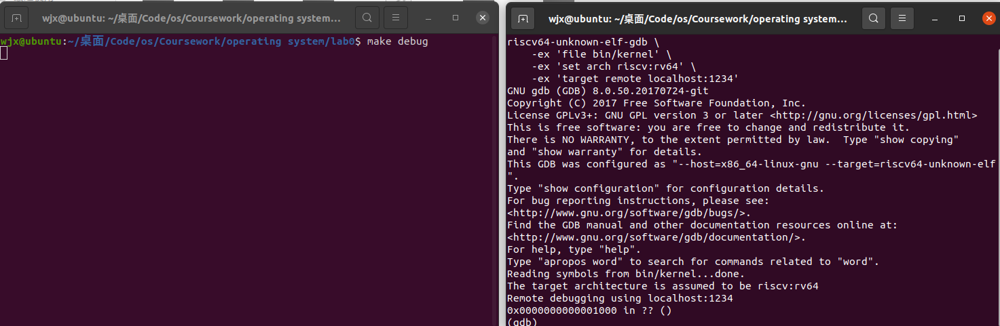

随后我们开始执行调试，先看一下要执行的指令：`x/10i $pc`

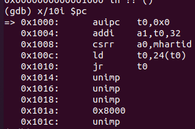

可以看到，目前pc位于0x1000处，是qemu的cpu的复位地址，会先去执行复位操作，随后加载sbi作为bootloader，但是分析上面的代码我们可以看到，其并没有加载操作，因为bootloader已经被事先加载到了物理地址的0x80000000处，上面的复位代码所执行的就是一个跳转到0x80000000的作用。

随后我们顺序执行，并查看t0寄存器的值：

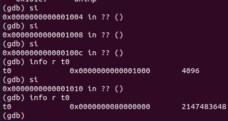

可以看到，t0寄存器的值已经被赋值为要跳转的地址了，随后就是执行jr命令跳转到此地址处。

随后我们执行命令，发现已经跳转到了0x80000000处，开始执行bootloader装载os镜像：

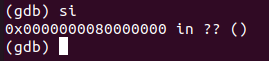

随后呢，会执行entry.s中分配数据空间和内核栈的汇编代码：

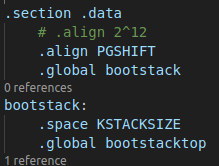

具体不作分析，我们随后在0x80200000 处设置断点，可以看到，提示处在entry.s的第七行：也即kern_entry的符号的定义的下一行，开始执行内核的初始化。

在设置完断点之后，执行continue，随后可以看到其在entry.s的第七行处停止，符合我们的预期：

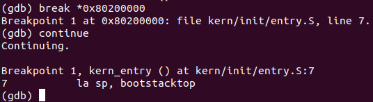

**总结**:

- RISC-V硬件加电后的第一部分指令存在0x1000-0x101a处，实际上真正执行的指令在0x1000-0x1010处，0x1018处存储了一个数据(也就是0x80000000，是前面几步的运算结果的存储处，从下面的命令可以看到，就是从0x1000偏移24字的地方加载其数据到t0)：

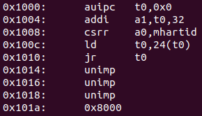

- RISC-V硬件加电后的第二部分指令存储在0x80000000-0x80200000处，具体指令数在此没有去查阅，为entry.s中分配数据空间和内核栈的汇编代码(上文中有分析)，其目的是将os镜像加载到0x80200000处，随后跳转到0x80200000处开始执行。

##### RISC-V硬件加电后的几条指令完成了哪些功能？

- RISC-V硬件加电后的第一部分指令是复位指令，内容在上文的内容中，其主要执行一个数据运算，将0x1018处的数据计算为0x80000000，随后将该地址处的数据装载到t0寄存器中，随后跳转到t0寄存器所存的地址处，开始执行bootloader。
- RISC-V硬件加电后的第二部分指令主要是执行bootload的功能，源码在上文中也含有，具体按地址排序的展开后的汇编代码在此不作展示，其主要功能就是将os镜像加载到0x80200000处，随后跳转到0x80200000处开始执行。

### 二、实验中的知识点

#### 复位和bootload

计算机在加电之后，首先执行一段确定的命令（这往往在硬件方面就已经焊入其中），执行各部件的复位操作，随后会执行另一个焊入硬件的程序，即bootloader（也或是bios），其主要负责加载我们的操作系统的内核，这之后才是将程序的执行权转到操作系统。

#### gdb调试

gdb调试真的强大，是在机器码的层次去执行调试的工具，其与平常在vscode等工具里面调试算法不同，更多的会去关注地址、汇编和寄存器等，能够很好的去监视CPU的运行状态，~~是debug界的又一大折磨王~~。

#### GNU make的使用

主要涉及的为makefile的编写，以前所写过的makefile没有这么大的，这次长见识了，具体规则尚在学习中


#### RISC-V指令集的汇编代码

已经预料到了课程会与汇编代码打交道，但是以往的课程并不是此架构的，因此对于RISCV架构的汇编代码的具体含义还需要学习，~~不然看不懂代码~~

#### 内存布局，链接脚本

虽然在实验中没有具体体现，但是其本质的思想，在一个空间内，各代码段的含义和存放规则也是必须掌握的基础知识。

### 三、实验中没有用到但是很重要的知识点

#### 操作系统的内核

定义为：“内核”指的是一个提供硬件抽象层、磁盘及文件系统控制、多任务等功能的系统软件。内核是操作系统最基本的部分。它是为众多应用程序提供对计算机硬件的安全访问的一部分软件，这种访问是有限的，并且内核决定一个程序在什么时候对某部分硬件操作多长时间。直接对硬件操作是非常复杂的，所以内核通常提供一种硬件抽象的方法来完成这些操作。硬件抽象隐藏了复杂性，为应用软件和硬件提供了一套简洁，统一的接口，使程序设计更为简单。

简单来说，内核是一个操作系统的核心。它负责管理系统的进程、内存、设备驱动程序、文件和网络系统等等，决定着系统的性能和稳定性。是连接应用程序和硬件的桥梁。
内核就是操作系统背后黑盒的核心。


## lab1

### 一、练习

#### 理解内核启动中的程序入口操作

对于指令`la sp, bootstacktop`，首先看指令：la是riscv的伪指令，为load address，也就是取地址，sp为栈顶指针寄存器，bootstacktop为内核栈的顶部（我们自己定义的），指令的操作就是把我们自己定义的label：bootstacktop的地址存入到sp寄存器中，目的很简单，就是在内核栈初始化完成后，栈需要从高地址向低地址增长，去把我们的操作系统内核放到那里去，其开始的点就是我们所提前预定好的bootstacktop处开始。这条指令的本质，我个人认为，就是通过自定义一个label，实现人为的选择内核要装载到的地方。

对于第二条指令`tail kern_init`，同样先看指令：tail同样为riscv的伪指令，格式为tail symbol，具体的实现为设置 pc 为 symbol，同时覆写 x[6]，官方手册给出的真正指令为`pc = &symbol; clobber x[6]`，在此对于x[6]的修改暂不讨论，于本实验而言，其实现的操作主要为将pc寄存器的值（也就是要执行的下一条指令的地址）设置为kern_init的label所对应的地址，进而实现了cpu跳转开始执行kern_init处的指令的目的。

#### 完善中断处理 （需要编程）

**实现过程和定时器中断中断处理的流程**

实现过程非常的简单，因为相关的接口和处理都已经定义好了，只需要调用即可：

```
clock_set_next_event( );
ticks++;
if(ticks%TICK_NUM==O) print_ticks( );
if(ticks==1000) sbi_shutdown( );
```

具体流程为：最开始在init（）等的函数中设置了第一个中断的时刻>>跳转到kern/trap/trapentry.S的__alltraps标记 >> 保存当前执行流的上下文，并通过函数调用，切换为kern/trap/trap.c的中断处理函数trap()的上下文，进入trap()的执行流>>切换前的上下文作为一个结构体，传递给trap()作为函数参数 >> kern/trap/trap.c按照中断类型进行分发(trap_dispatch(), interrupt_handler())>>执行时钟中断对应的处理语句，跳转到IRQ_S_TIMER处>>执行上面的代码块，具体为设置下一次的中断时间，ticks计数器累加，随后是两个触发的判定>>完成处理，返回到kern/trap/trapentry.S->恢复原先的上下文，中断处理结束。

具体实现的运行结果如下：


可以看到，成功输出，并且在输出10行后自动关机。

#### Challenge1：描述与理解中断流程

ucore中处理中断异常的流程：异常产生>>保存上下文>>CPU跳到`stvec`，寻找到对应的处理程序入口点>>处理中断异常>>恢复上下文>>继续执行。

对于指令`move a0,sp`，其本质是将sp的值赋值给a0，而下面我们要调用trap函数，其参数列表为一个参数：struct trapframe* tf，而sp恰好又指向了一个我们刚刚通过 SAVE_ALL保存的一个上文（其内除了我们所要保存的寄存器的值，最重要的是有四个CSR，这四个CSR才是需要在trap中作为参数使用的），因此sp的本质其实就是一个trapframe*，通过这个指令，我们实现了将刚保存完的上文作为一个 trapframe传入到了中断处理程序trap（但是实际上我们所需要的更多是其内的四个CSR，这也是这一步的设计目的所在）。

对于SAVE_ALL中寄存器保存在栈中的位置是什么确定的这一问题，首先由代码`STORE x1,n*REGBYTES(sp)`可以知道，其存在sp往高地址延伸的第n个（大体是这么个意思，不好描述，总之就是n越大地址越高，因为本身其地址是sp+offset(n))，最后，其位置，也就是n是几，因为我们的sp本质上是个trapframe指针，因此呢，我们在存储的时候，必须要保证其往下的空间是符合一个trapframe的（因为sp本质上存的是个地址，编译器不知道这个是不是一个trapframe，毕竟我们随便找个地址都可以欺骗编译器说是一个trapframe的指针，当然我们不能这么干。。因为我们真的需要它是一个trapframe），故而n是几这个问题，其实是由trapframe的定义所决定的（比如其定义里面，sp是第二个，因此可以看到，在那一坨代码里面，2*REGBYTES(sp)并不是在那一坨里面，而是在后面，由此可以看见，SAVE_ALL里面那个n不是随便写的。

最后，对于任何中断，__alltraps 中都需要保存所有寄存器吗?这个问题，从规范上来讲，我认为是需要的，因为这个问题应该是定义为一个严格的规范，但是实际情况中，有的中断并不会修改某些寄存器的值，因此从这个中断的角度看，统一规范化的保存全部寄存器是多余的，是浪费时间、浪费空间的，确实如此，或许我们可以对某一类中断，开发一个优化模式，使得一定不会被改变的寄存器不保存，但从一个架构的规范性、统一性来看，保存全部的时间、空间，有时候是必要的。

#### Challenge2：理解上下文切换机制

对于指令`csrw sscratch, sp；csrrw s0, sscratch, x0`，我们两条指令一起看，csrw就是将sp的值写入到sscratch，后面的csrrw是读后写状态寄存器，就是将sscratch的值先写入到s0中，随后将x0的值写入到sscratch，目的其实就是将sp存入到s0中，将x0存入到sscratch中，在csrw中，并不一定是sscratch，也可以是其他的csr，但是因为sp要在接下来需要偏移，所以我们需要提前把sp存起来，而x0本身就是需要写入到sscratch的值。

save all里面保存了stval scause这些csr，而在restore all里面却不还原它们，其原因很简单，在我们的代码中，save_all本质上是保存上文+将状态传入处理程序这两个作用，4个csr寄存器保存的是在接受到中断后的相应的值，因此其主要在中断处理中起作用，而恢复的时候我们的下一步操作是正常执行，csr中是不应该有相关中断的信息的，因此没必要还原他们（但是在restore all中也有几个是恢复的了，因为其信息所代表的不是中断，是正常执行过程中的一些信息，因此这些是需要恢复的，但像stval scause这些是给中断用的，而中断已经处理完了，自然没必要恢复）。store的意义，其实就是为了满足上文中所说的，满足一个trapframe的格式，作为参数传入处理程序。

#### Challenge3：完善异常中断

编程非常简单，就几行，主要在于前提和部分说明，下面的手册是RV 硬件简要手册（网站上的参考资料）：

首先，先看如何获得发生异常的指令的地址。查阅手册，发现：

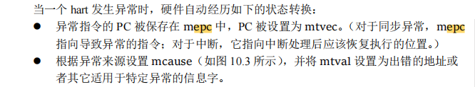

问题就很简单了，直接读一下epc的值，就是产生了异常的指令的地址。

随后就是如何获取异常的指令的类型，也很简单：

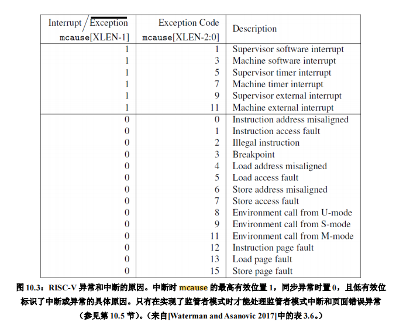

由手册查阅即可得到对于的数字号所表示的异常类型，但其实也不必这么麻烦，因为在我们的程序中：

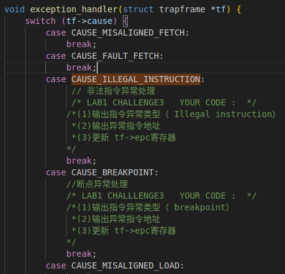

我们在分发的时候，其实已经在下面的define里面识别了具体的类型：

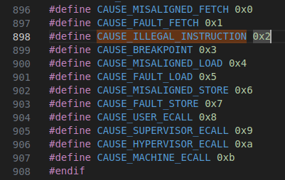

所以我们只需要看着上面的分发的部分的case后面的名称，直接输出对应的字符串就行了。~~乐，难绷~~

对于更新值，异常与中断不同，其所要恢复的值应该是发生异常的指令的下一条指令，因此tf->epc寄存器赋值为原本的值+64即可。

代码如下：

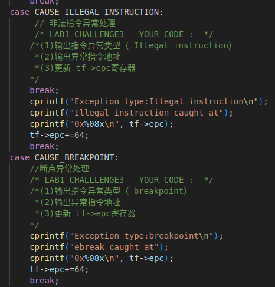

添加breakpoint：直接使用命令`ebreak`即可。

如下图：

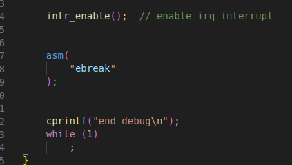

现在注释掉时钟中断的部分，验证结果如下：

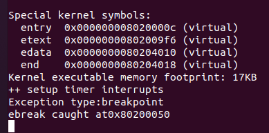

看到成功捕捉到了。

对于非法指令的验证，采取如下：

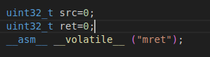

验证结果如下：

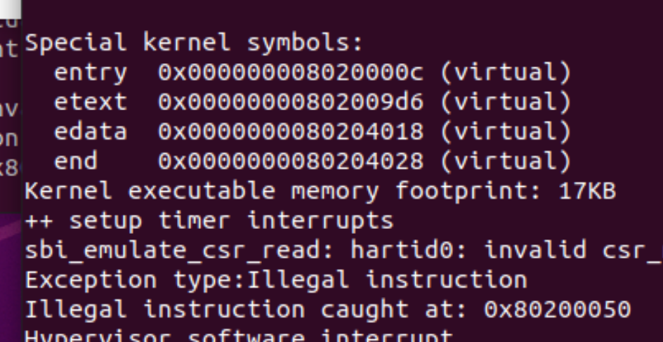

随后`make grade`查看分数

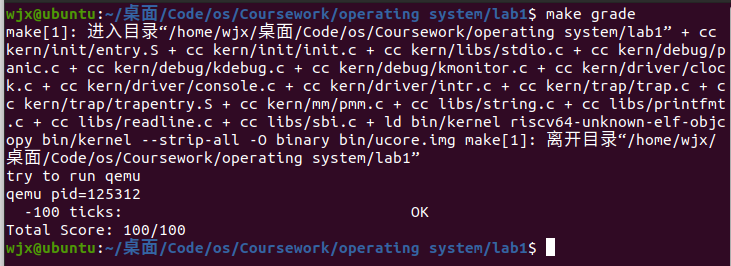

### 实验中的知识点

#### RISC-V中的中断与异常

中断和异常的概念：

- 中断（Interrupt）是外部事件的通知，它可以是硬件设备生成的，需要处理器立即响应。中断可以用于处理外部设备的输入、时钟事件等。

- 异常（Exception）是指令执行过程中的错误或不寻常事件，它可能是由于程序错误（如除零错误）或系统条件（如页面错误）而引发的。异常通常需要在程序中进行错误处理。

中断处理的步骤：

- 当中断发生时，处理器首先保存当前的上下文（包括程序计数器和寄存器值）。

- 处理器根据中断的优先级跳转到相应的中断处理例程。

- 中断处理例程执行完成后，处理器恢复之前保存的上下文，继续执行被中断的程序。

异常处理的步骤：

- 异常的处理流程类似于中断，但通常与指令执行相关。

- 异常例程执行的内容取决于异常类型，例如，页面错误需要进行页面表操作，除零错误需要中止执行等。

### 实验中没有的知识点

#### CSR寄存器

CSR（Control and Status Register，控制和状态寄存器）是一组特殊寄存器，用于控制处理器的行为和管理处理器状态。这些CSR寄存器提供了对处理器控制和状态的访问和操作，用于配置、监控和控制不同的系统和处理器功能。

CSR寄存器可以具有不同的读取（R）、写入（W）和读取-写入（RW）权限。通常只有特定的汇编命令才能对CSR寄存器进行操作，避免不经意的修改它们。

常见的CSR寄存器：

- mstatus：包含了机器模式的一些状态位，如全局中断使能位、特权级别等。

- mcause：存储最近的异常原因或中断号，用于异常处理程序确定异常类型。

- mtvec：设置机器模式下的异常处理入口地址，控制异常处理的跳转目标。

- mepc：存储异常程序计数器，保存异常发生时的指令地址。

- mie和mip：用于启用和监控中断，分别控制中断的使能和中断挂起状态。
