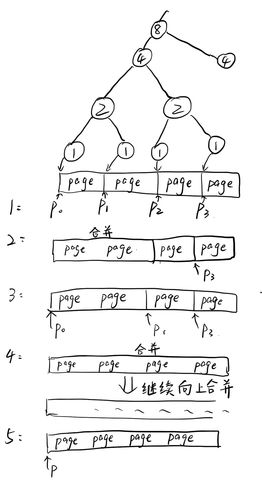
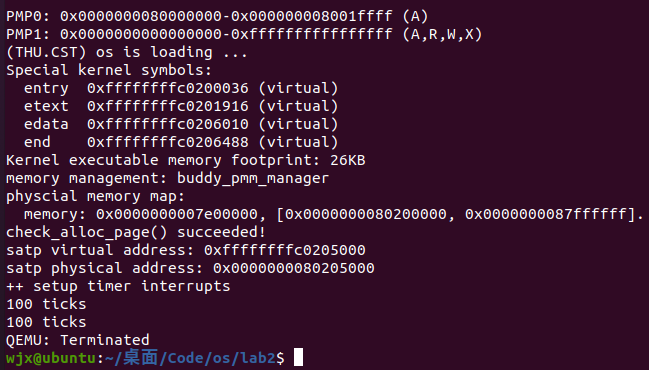

# <center>os-lab2-buddy system（伙伴系统）分配算法

#### <center>实现人员与源代码链接

- 2112495魏靖轩
- [仓库](https://github.com/J1ngxuanWei/Operating-System/tree/main/lab2)中的buddy_pmm.h与buddy_pmm.c文件。

# <center>算法实现参考

[伙伴分配器的一个极简实现](https://coolshell.cn/articles/10427.html)

[向勇老师算法讲解](http://video.mobisys.cc/OSMOOC/03%E5%86%85%E5%AD%98%E7%AE%A1%E7%90%86/5.5%20%E4%BC%99%E4%BC%B4%E7%B3%BB%E7%BB%9F.mp4)

# <center>算法原理

伙伴分配的实质就是一种特殊的“分离适配”，即将内存按2的幂进行划分，相当于分离出若干个块大小一致的空闲链表，搜索该链表并给出同需求最佳匹配的大小。

分配的时候选择最小的一个块，如果小，找比它大2倍的，重复，到找到第一个满足的。随后看该快是否满足要分配的大小大于该块的一半，同时小于等于该块的大小，如果满足，就分配这个；如果不满足，把这个块切半，重复上述过程。

回收的时候直接释放，但是因为是连续内存分配，所以需要考虑合并，依据**注意**合并即可，需要不断向上检索是否能合并，直到返回不能合并为止。

# <center>算法实现

## 数据结构

我们使用一个数组来维护，我们可以将内存看成一个完全二叉树（因为每次都切半，也就是每个节点一旦要向下拓展，一定有两个子节点）。

## 初始化空闲链表

好像没用，不过要求`buddy_init`函数。

> **因为算法用不到这个空闲链表，所以下面的算法都没有写关于这个链表的部分。**

## 初始化内存区域和节点信息

从`page_init()`函数调用`init_memmap(pa2page(mem_begin), (mem_end - mem_begin) / PGSIZE);`函数来初始化我们manager能够管理的内存，首先需要将page的个数n向下对齐2的幂。

在此规定从base地址开始，舍去最后的部分以此来对齐2的幂。

对于数组，我们抽象成直接在物理内存上做操作（因为不能用c库。。不能动态声明数组。。。淦），从`buddy_init_memmap`接收到的base作为数组的起始地址，数组的索引是页的索引，也就是说我们base[i]就是第i个页的地址处存的数。

我们实验使用sv39，一个页表项是64位，所以起始地址要定义为64位整数，就可以使用这种方式访问了。

此外，每个节点有信息：

- size:此节点的大小。
- property:此节点还能用的（还能分配的）的大小。

## 定义辅助函数

数学用途：

```c
// 求以2为底数，n为指数的值
int32_t pow2(int32_t n){
    int32_t result=1;
    for(int i=0;i<n;i++)
    result*=2;
    return result;
};

// 对数向上、向下取整函数簇
int32_t log2_round_up(int32_t n){
    int32_t temp =n;
    int32_t result=0;
    while(n!=1){
        result++;
        n/=2;
    }
    if(temp%2==1)
    return result+1;
    return result;
};

int32_t log2_round_down(int32_t n){
    int32_t result;
    while(n!=1){
        result++;
        n/=2;
    }
    return result;
};
```

二叉树操作函数：

```c
#define BUDDY_ROOT              (1)
#define BUDDY_LEFT(a)           ((a)<<1)
#define BUDDY_RIGHT(a)          (((a)<<1)+1)
#define BUDDY_PARENT(a)         ((a)>>1)

//查询节点的大小
#define BUDDY_SIZE(a)           (buddy_size/log2_round_down(a))
//查询节点是否没有分配过
#define BUDDY_EMPTY(a)          (buddy_array[(a)] == BUDDY_SIZE(a))
```

## 初始化部分

抄过来函数：

```c
static void buddy_init(void) {
    list_init(&free_list);
    nr_free = 0;
}
```

## buddy_init_memmap函数

首先是老生常谈，初始化page：

```c
    assert(n > 0);
    struct Page *p = base;
    for (; p != base + n; p ++) {
        assert(PageReserved(p));
        p->flags = p->property = 0;
        set_page_ref(p, 0);
    }
```

随后是上面所定义的，将n向下取整到2的幂。

```c
// 将n向下取整到2的幂
    n=log2_round_down(n);
```

把base的地址（物理地址），转到虚拟地址，因为我们会直接写上面的数据，作为这个树还剩下多少个页能分配，如果直接写物理内存会出问题。

随后设置各变量的值，把第一个页表处设置为我们的n。

```c
// 把base的地址（物理地址），转到虚拟地址，因为我们会直接写上面的数据，作为这个树还剩下多少个页能分配，如果直接写物理内存会出问题。
    buddy_array = KADDR(page2pa(base));
    memset(buddy_array, 0, n*PGSIZE);
    nr_free += n;
    buddy_array[BUDDY_ROOT]=n;
```

## buddy_alloc_pages函数

Buddy System 要求分配空间为 2 的幂，所以首先将请求的页数向上对齐到 2​ 的幂。

```c
    assert(n > 0);
    struct Page *page;
    int64_t block = BUDDY_ROOT;
    int64_t length = pow2(log2_round_up(n));
    if(n==1)length=1;
```

接下来从二叉树的根节点（1号节点）开始查找满足要求的节点。对于每次检查的节点：

- 如果子树的最大可用空间小于请求空间，那么分配失败；
- 如果子树的最大可用空间大于等于请求空间，并且总空间大小等于请求空间，说明这个节点对应的空间没有被分割和分配，并且满足请求空间大小，那么分配这个空间；
- 如果子树的最大可用空间大于等于请求空间，并且总空间大小大于请求空间，那么在这个节点的子树中查找：
  - 如果这个节点对应的空间没有被分割过（最大可用空间等于总空间大小），那么分割空间，在左子树（左半部分）继续查找；
- 如果左子树的最大可用空间大于等于请求空间，那么在左子树中继续查找；
  - 如果右子树的最大可用空间大于等于请求空间，那么在右子树中继续查找。

```c
// 查找满足要求的节点
    while (length <= buddy_array[block]) {
        int64_t left = BUDDY_LEFT(block);
        int64_t right = BUDDY_RIGHT(block);
        if (BUDDY_EMPTY(block)) {
            // 分割
            buddy_array[left] = buddy_array[block]>>1;
            buddy_array[right] = buddy_array[block]>>1;
            block = left;
        } else if (length <= buddy_array[left]) { 
            block = left;
        } else if (length <= buddy_array[right]) {
            block = right;
        } else {
            // DEBUG                                    
            assert(0);
        }
    }
```

将一个节点的值设置为0表示它已经被分配（可分配的空间为0）。

```c
// 分配
    int strr=buddy_size/pow2(log2_round_down(block))*(block-pow2(log2_round_down(block)));
    page = buddy_base+strr;
    buddy_array[block] = 0;
    nr_free -= length;
```

当一个空间被分配之后，这个空间对应节点的所有父节点的可用空间表都会受到影响，需要自地向上重新更新可用空间信息。

```c
   // 更新可用空间信息
    while (block != BUDDY_ROOT) {
        block = BUDDY_PARENT(block);
        buddy_array[block] = buddy_array[BUDDY_LEFT(block)] | buddy_array[BUDDY_RIGHT(block)];
    }
```

## buddy_free_pages函数

Buddy System 要求分配空间为 2 的幂，所以同样首先将请求的页数向上对齐到2的幂。

```c
    assert(n > 0);
    struct Page *p = base;
    int64_t length = log2_round_up(n);
```

其次寻找到需要释放的块的索引：

```c
    int64_t begin = (base-buddy_base);
    int64_t end = begin + length;
    int64_t block = buddy_size/length+begin/length;
```

然后将空间标记为可用：

```c
// 将空间标记为可用
    for (; p != base + n; p ++) {
        assert(!PageReserved(p));
        p->flags = 0;
        set_page_ref(p, 0);
    }
    nr_free += length;
    buddy_array[block] = length;
```

接下来进行自底向上的合并更新：

- 如果某节点的两个子节点对应的空间都未分割和分配，那么合并这两个空间，形成一个更大的空间；
- 否则，根据子节点的可用空间信息更新父节点的可用空间信息。

```c
    // 合并更新
    while (block != BUDDY_ROOT) {
        block = BUDDY_PARENT(block);
        int64_t left = BUDDY_LEFT(block);
        int64_t right = BUDDY_RIGHT(block);
        if (BUDDY_EMPTY(left) && BUDDY_EMPTY(right)) {
            buddy_array[block] = buddy_array[left]<<1;
        } else {
            buddy_array[block] = buddy_array[BUDDY_LEFT(block)] | buddy_array[BUDDY_RIGHT(block)];
        }
    }
```

# <center>算法测试

## buddy_check函数

此函数主要是测试的，因为这个算法并不需要操作和访问空闲链表，因此上面没有写关于链表的部分。因此不测试链表。

先检查一下我们的宏定义和二叉树的基本操作：

```c
static void basic_check(void) {
    assert(BUDDY_ROOT == 1);
    assert(BUDDY_LEFT(3) == 6);
    assert(BUDDY_RIGHT(3) == 7);
    assert(BUDDY_PARENT(6) == 3);
    assert(BUDDY_PARENT(7) == 3);

    buddy_array[BUDDY_ROOT] = 16;
    assert(BUDDY_SIZE(10) == 2);
    assert(BUDDY_BLOCK(8, 12) == 6);
    assert(BUDDY_EMPTY(BUDDY_ROOT));
}
```

随后我们手动建立一个区域来进行测试：

```c
// 手动建立一个区域来进行测试
    size_t buddy_physical_size_store = buddy_size;
    for (struct Page *p = buddy_base; p < buddy_base + 1026; p++)
        SetPageReserved(p);
    buddy_init();
    buddy_init_memmap(buddy_base, 1026);

    // 测试一下分配页
    struct Page *p0, *p1, *p2, *p3;
    p0 = p1 = p2 = NULL;
    assert((p0 = alloc_page()) != NULL);
    assert((p1 = alloc_page()) != NULL);
    assert((p2 = alloc_page()) != NULL);
    assert((p3 = alloc_page()) != NULL);

    assert(p0 + 1 == p1);
    assert(p1 + 1 == p2);
    assert(p2 + 1 == p3);

    // 测试一下回收页
    assert(nr_free == buddy_size-4);
    free_page(p0);
    free_page(p1);
    free_page(p2);
    assert(nr_free == buddy_size-1);

    assert((p1 = alloc_page()) != NULL);
    assert((p0 = alloc_pages(2)) != NULL);
    assert(p0 + 2 == p1);

    free_pages(p0, 2);
    free_page(p1);
    free_page(p3);

    struct Page *p;
    assert((p = alloc_pages(4)) == p0);

    // Restore buddy system
    for (struct Page *p = buddy_base; p < buddy_base + buddy_physical_size_store; p++)
        SetPageReserved(p);
    buddy_init();
    buddy_init_memmap(buddy_base, buddy_physical_size_store);
```

上面的测试思路是这样的：

首先，我们的算法的分配是抽象为二叉树进行管理的，我们在寻找时，优先访问左子树，也就是说，如果我们要求一个大小为1个页的大小，会从根节点一直访问左子树并分割，最后达到节点为1个页大小，其间都是走的左子树路径。

我们的算法的分配是抽象为二叉树进行管理的，这个二叉树，如果我们将每个节点都分割，让其拥有左子树和右子树，直到这个节点代表的为1个页不能再分割，那么从左到右的节点所代表的页的地址是连续且递增的（也就是最左边的是起始地址，最右边的是我们的所能分配的物理内存的结束地址减去一个页的地址）。

基于上面假设，我们思路是先要求4个大小为1个页的内存，这4个的地址应该是连续的（因为遵循我们的首先访问左子树原则）。

随后我们回收前三个，在申请一个一个页大小和一个两个页大小的，此时我们知道，0和1代表的应该已经合并，因此两个页大小的会被分配给这个合并的块，具体过程如下：



然后我们回收全部的内存，然后我们再申请一个4个大小的，证明这四个块也发生了迭代的合并，且分配得到的是这个块（p0是个指针，指向的值不会因为回收而被修改，此时它的值是最左边，也就是初始页的值）：

随后我们进行`make qemu`执行这个检测函数查看结果：



成功通过测试样例。
