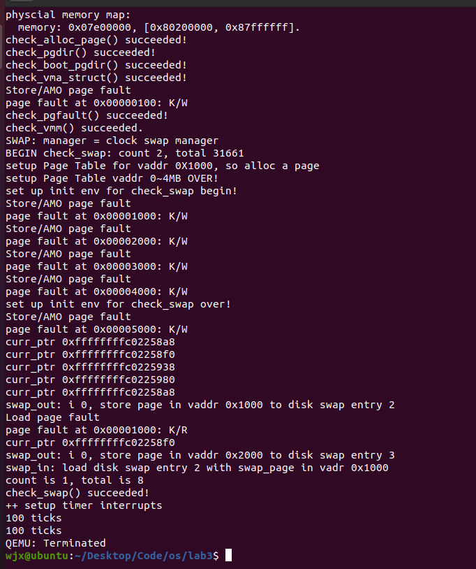
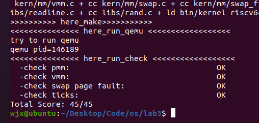

# <center>os-lab3 实验报告

## <center>组内人员与源码链接

- 2112495魏靖轩
- 2111822张浩龙
- 2113202刘子瑞

源码仓库：[Github](https://github.com/J1ngxuanWei/Operating-System/tree/main/lab3)

## <center>练习

[lab3%20实验报告.md](https://github.com/AngelKitty/review_the_national_post-graduate_entrance_examination/blob/master/books_and_notes/professional_courses/operating_system/sources/ucore_os_lab/docs/lab_report/lab3/lab3%20实验报告.md)

### <center>练习1：理解基于FIFO的页面替换算法（思考题）

> **此练习依托于完成练习3的代码。**

首先，在正常运行中，当将要发生页面的换入换出时，会首先引发一个异常，进入`trap.c`中：

```c
        case CAUSE_LOAD_PAGE_FAULT:
            cprintf("Load page fault\n");
            if ((ret = pgfault_handler(tf)) != 0) {
                print_trapframe(tf);
                panic("handle pgfault failed. %e\n", ret);
            }
            break;
        case CAUSE_STORE_PAGE_FAULT:
            cprintf("Store/AMO page fault\n");
            if ((ret = pgfault_handler(tf)) != 0) {
                print_trapframe(tf);
                panic("handle pgfault failed. %e\n", ret);
            }
```

随后根据是`LOAD`还是`STORE`，进入不同的处理，随后进入`pgfault_handler`异常处理函数：

```c
static int pgfault_handler(struct trapframe *tf) {
    extern struct mm_struct *check_mm_struct;
    print_pgfault(tf);
    if (check_mm_struct != NULL) {
        return do_pgfault(check_mm_struct, tf->cause, tf->badvaddr);
    }
    panic("unhandled page fault.\n");
}
```

随后在该函数内进入`do_pgfault`函数中，该函数是用于处理页面错误执行的中断处理程序，这个函数是整个页面换入换出的总控函数，会在此函数体内处理异常信息，确定需要进行页面换入还是换出，随后分发到不同的处理函数中进行页面的换入或者换出。

我们假定都已经做好了初始化。

现在我们假定一个页面被处理，即将从磁盘中被换入到内存中，它将会经历下面的过程：

#### 页面换入

当需要换入时，首先会执行`do_pgfault`函数中的代码：

```c
    if (swap_init_ok) {
            struct Page *page=NULL;//根据 mm 结构和 addr 地址，尝试将硬盘中的内容换入至 page 中
            if ((ret = swap_in(mm, addr, &page)) != 0) {
                cprintf("swap_in in do_pgfault failed\n");
                goto failed;
            }    
            page_insert(mm->pgdir, page, addr, perm);//建立虚拟地址和物理地址之间的对应关系
            swap_map_swappable(mm, addr, page, 1);//将此页面设置为可交换的
            page->pra_vaddr = addr;
```

我们会进入`swap_in`函数，来得到一个换入的页：

```c
swap_in(struct mm_struct *mm, uintptr_t addr, struct Page **ptr_result)
{
     struct Page *result = alloc_page();
     assert(result!=NULL);

     pte_t *ptep = get_pte(mm->pgdir, addr, 0);
     // cprintf("SWAP: load ptep %x swap entry %d to vaddr 0x%08x, page %x, No %d\n", ptep, (*ptep)>>8, addr, result, (result-pages));
    
     int r;
     if ((r = swapfs_read((*ptep), result)) != 0)
     {
        assert(r!=0);
     }
     cprintf("swap_in: load disk swap entry %d with swap_page in vadr 0x%x\n", (*ptep)>>8, addr);
     *ptr_result=result;
     return 0;
}
```

我们的页是从第一行，`alloc_page()`处获得，我们看这个函数：

```c
struct Page *alloc_pages(size_t n) {
    struct Page *page = NULL;
    bool intr_flag;

    while (1) {
        local_intr_save(intr_flag);
        { page = pmm_manager->alloc_pages(n); }
        local_intr_restore(intr_flag);

        if (page != NULL || n > 1 || swap_init_ok == 0) break;

        extern struct mm_struct *check_mm_struct;
        // cprintf("page %x, call swap_out in alloc_pages %d\n",page, n);
        swap_out(check_mm_struct, n, 0);
    }
    // cprintf("n %d,get page %x, No %d in alloc_pages\n",n,page,(page-pages));
    return page;
}
```

这个函数通过不断的换出页面来使得我们能够成功从`pm`处获得一个分配的页面，此时，假设我们成功获得，那么此时，`while`循环内的`page`指针就不再是空值，随后执行了`local_intr_restore(intr_flag)`这个宏，定义如下：

```c
#define local_intr_restore(x) __intr_restore(x);
```

这个宏的作用就是通过判定`x`值是不是空来将异常处理寄存器设置为相应的值，以此来表示我们已经成功处理了这个异常了，可以将异常状态重置然后继续执行。

随后`if`判定会因为`page != NULL`而`break`跳出循环，随后被作为参数`return`。

随后我们又会进入`swap_in`函数，且得到了一个换入的页的指针：

```c
swap_in(struct mm_struct *mm, uintptr_t addr, struct Page **ptr_result)
{
     struct Page *result = alloc_page();
     assert(result!=NULL);

     pte_t *ptep = get_pte(mm->pgdir, addr, 0);
     // cprintf("SWAP: load ptep %x swap entry %d to vaddr 0x%08x, page %x, No %d\n", ptep, (*ptep)>>8, addr, result, (result-pages));
    
     int r;
     if ((r = swapfs_read((*ptep), result)) != 0)
     {
        assert(r!=0);
     }
     cprintf("swap_in: load disk swap entry %d with swap_page in vadr 0x%x\n", (*ptep)>>8, addr);
     *ptr_result=result;
     return 0;
}
```

随后会执行一次`assert(result!=NULL);`来确保我们的页是有效的，而不是`NULL`。随后我们得到要改变的页表`ptep`。

随后我们将这个页，作为参数，传入`swapfs_read`函数：

```c
int
swapfs_read(swap_entry_t entry, struct Page *page) {
    return ide_read_secs(SWAP_DEV_NO, swap_offset(entry) * PAGE_NSECT, page2kva(page), PAGE_NSECT);
}

```

这个函数是实现将硬盘里面的数据，写入到我们的`Page`指针所指向的地方，就是将我们换入的这个页的存储的内容从硬盘写到内存的对应地址处。

随后我们的这个要被换入的页就被赋值给了`ptr_result`指针作为结果`return`。

然后我们又回到了`do_pgfault`函数中的如下代码：

```c
    if (swap_init_ok) {
            struct Page *page=NULL;//根据 mm 结构和 addr 地址，尝试将硬盘中的内容换入至 page 中
            if ((ret = swap_in(mm, addr, &page)) != 0) {
                cprintf("swap_in in do_pgfault failed\n");
                goto failed;
            }    
            page_insert(mm->pgdir, page, addr, perm);//建立虚拟地址和物理地址之间的对应关系
            swap_map_swappable(mm, addr, page, 1);//将此页面设置为可交换的
            page->pra_vaddr = addr;
```

此时，我们这个要被换入的页，就被赋值给了上面的`page`变量，然后我们在执行完`if`语句块之后，我们进入`page_insert`函数：

```c
int page_insert(pde_t *pgdir, struct Page *page, uintptr_t la, uint32_t perm) {
    pte_t *ptep = get_pte(pgdir, la, 1);
    if (ptep == NULL) {
        return -E_NO_MEM;
    }
    page_ref_inc(page);
    if (*ptep & PTE_V) {
        struct Page *p = pte2page(*ptep);
        if (p == page) {
            page_ref_dec(page);
        } else {
            page_remove_pte(pgdir, la, ptep);
        }
    }
    *ptep = pte_create(page2ppn(page), PTE_V | perm);
    tlb_invalidate(pgdir, la);
    return 0;
}
```

在这个函数中，我们首先获得对应的页表项，随后根据这个页表项跟这个页是不是相等，分不同的情况释放这个页表项。然后根据我们的要换入的页的权限（由参数`PTE_V | perm`控制）重新对这个要换入的页建立页表项，也就是重新建立它的虚拟地址和物理地址之间的对应关系。然后刷新TLB。

然后我们又回到了`do_pgfault`函数中，随后我们会执行`swap_map_swappable`函数，这个函数是调用对应的`sw`的`_map_swappable`函数，来将这个页设置为可交换的，这样使得这个页在后面可以被换出。我们看FIFO的对应函数：

```c
static int
_fifo_map_swappable(struct mm_struct *mm, uintptr_t addr, struct Page *page, int swap_in)
{
    list_entry_t *head=(list_entry_t*) mm->sm_priv;
    list_entry_t *entry=&(page->pra_page_link);
 
    assert(entry != NULL && head != NULL);
    //record the page access situlation

    //(1)link the most recent arrival page at the back of the pra_list_head qeueue.
    list_add(head, entry);
    return 0;
}
```

实现非常简单，就是分别获得两个链表（目前可以被交换的页面的链表和这个页的链表），然后将这个页的加入到可以被交换的页面的链表中即可。

至此，我们这个被换入的页就被处理完了，开始在内存中被使用，直到它被要求换出。

#### 页面换出

我们继续上面这个页的旅程，当它被要求换出的时候，就说明我们在此之前发出了要换入页的请求，那么我们分析上面的过程，我们就可以知道，换出页的请求是源于`swap_in`的函数的`alloc_page`函数：

```c
struct Page *alloc_pages(size_t n) {
    struct Page *page = NULL;
    bool intr_flag;

    while (1) {
        local_intr_save(intr_flag);
        { page = pmm_manager->alloc_pages(n); }
        local_intr_restore(intr_flag);

        if (page != NULL || n > 1 || swap_init_ok == 0) break;

        extern struct mm_struct *check_mm_struct;
        // cprintf("page %x, call swap_out in alloc_pages %d\n",page, n);
        swap_out(check_mm_struct, n, 0);
    }
    // cprintf("n %d,get page %x, No %d in alloc_pages\n",n,page,(page-pages));
    return page;
}
```

在这个函数的内部，因为目前的空闲空间不足以支撑`pm`完成`alloc_pages`的操作，因此我们需要换出页，调用`swap_out`函数：

```c
int
swap_out(struct mm_struct *mm, int n, int in_tick)
{
     int i;
     for (i = 0; i != n; ++ i)
     {
          uintptr_t v;
          //struct Page **ptr_page=NULL;
          struct Page *page;
          // cprintf("i %d, SWAP: call swap_out_victim\n",i);
          int r = sm->swap_out_victim(mm, &page, in_tick);
          if (r != 0) {
                    cprintf("i %d, swap_out: call swap_out_victim failed\n",i);
                  break;
          }          
          //assert(!PageReserved(page));

          //cprintf("SWAP: choose victim page 0x%08x\n", page);
          
          v=page->pra_vaddr; 
          pte_t *ptep = get_pte(mm->pgdir, v, 0);
          assert((*ptep & PTE_V) != 0);

          if (swapfs_write( (page->pra_vaddr/PGSIZE+1)<<8, page) != 0) {
                    cprintf("SWAP: failed to save\n");
                    sm->map_swappable(mm, v, page, 0);
                    continue;
          }
          else {
                    cprintf("swap_out: i %d, store page in vaddr 0x%x to disk swap entry %d\n", i, v, page->pra_vaddr/PGSIZE+1);
                    *ptep = (page->pra_vaddr/PGSIZE+1)<<8;
                    free_page(page);
          }
          
          tlb_invalidate(mm->pgdir, v);
     }
     return i;
}
```

我们首先看`alloc_pages`函数，如果有足够的物理页面，就不必换出其他页面，如果n>1, 说明希望分配多个连续的页面，但是我们换出页面的时候并不能换出连续的页面，所以这里的n必为1，也就是说这个for循环只执行一次。

我们首先定义一个`Page`指针，然后调用`sm`的`swap_out_victim`函数，这里我们是FIFO的对应的函数：

```c
static int
_fifo_swap_out_victim(struct mm_struct *mm, struct Page ** ptr_page, int in_tick)
{
     list_entry_t *head=(list_entry_t*) mm->sm_priv;
         assert(head != NULL);
     assert(in_tick==0);
     /* Select the victim */
     //(1)  unlink the  earliest arrival page in front of pra_list_head qeueue
     //(2)  set the addr of addr of this page to ptr_page
    list_entry_t* entry = list_prev(head);
    if (entry != head) {
        list_del(entry);
        *ptr_page = le2page(entry, pra_page_link);
    } else {
        *ptr_page = NULL;
    }
    return 0;
}
```

这个函数的作用非常简单，就是指出哪个页需要被换出，我们通过代码`list_entry_t* entry = list_prev(head);`指出了需要被换出的页，然后使用`le2page`函数得到了这个`Page`指针，赋值给了`ptr_page`，然后返回被赋值给了`swap_out`中的`page`，这样我们这个页就被找到了。

然后我们得到这个页的虚拟地址和对应的页表项的虚拟地址，然后我们执行`swapfs_write`宏：

```c
int
swapfs_write(swap_entry_t entry, struct Page *page) {
    return ide_write_secs(SWAP_DEV_NO, swap_offset(entry) * PAGE_NSECT, page2kva(page), PAGE_NSECT);
}
```

这个宏的作用很简单，就是把这个页所对应的地址在内存中的数据写到磁盘中的对应地址处，实现将页从内存拷贝到磁盘的工作。然后我们调用`sm`的`map_swappable`函数，其中的`swap_in` 参数设为0，就是说将这个页设为不可交换状态（指不能从内存交换到磁盘）（因为这个页已经被换出了，不存在于内存了，自然不能被交换）。

随后刷新TLB，关于这个页的换出操作就结束了。

### <center>练习2：深入理解不同分页模式的工作原理（思考题）

首先是`get_pte()`函数的源代码：

```c
pte_t *get_pte(pde_t *pgdir, uintptr_t la, bool create) {
    pde_t *pdep1 = &pgdir[PDX1(la)];
    if (!(*pdep1 & PTE_V)) {
        struct Page *page;
        if (!create || (page = alloc_page()) == NULL) {
            return NULL;
        }
        set_page_ref(page, 1);
        uintptr_t pa = page2pa(page);
        memset(KADDR(pa), 0, PGSIZE);
        *pdep1 = pte_create(page2ppn(page), PTE_U | PTE_V);
    }
    
    pde_t *pdep0 = &((pde_t *)KADDR(PDE_ADDR(*pdep1)))[PDX0(la)];
    if (!(*pdep0 & PTE_V)) {
    	struct Page *page;
    	if (!create || (page = alloc_page()) == NULL) {
    		return NULL;
    	}
    	set_page_ref(page, 1);
    	uintptr_t pa = page2pa(page);
    	memset(KADDR(pa), 0, PGSIZE);
    	*pdep0 = pte_create(page2ppn(page), PTE_U | PTE_V);
    }
    return &((pte_t *)KADDR(PDE_ADDR(*pdep0)))[PTX(la)];
```

#### get_pte()函数中有两段形式类似的代码， 结合sv32，sv39，sv48的异同，解释这两段代码为什么如此相像。

首先看这两段代码，可以看到其都在执行类似的操作：建立页表项（也就是页表的页表，即PDT），而在sv32，sv39，sv48中，其区别主要在于页表的层次的多少，其分别对应二级页表、三级页表、四级页表。

但是无论是几级页表，我们在创建PDT的时候，我们基本都是遵循下面的过程：由于我们已经具有了一个物理内存页管理器 default_pmm_manager，我们就可以用它来获得所需的空闲物理页。 在二级页表结构中，页目录表占 4KB 空间，ucore 就可通过 default_pmm_manager 的 default_alloc_pages 函数获得一个空闲物理页，这个页的起始物理地址就是页目录表的起始地址。

同理，无论是几级页表的页表项，其本质都是一个页表，只不过他们的区别在于每个叶节点指向的是物理页还是一个页表。但无论指向的是什么，其本质上还是一个指针，因此对于其处理基本类似。

而上面的两段类似的代码，则是都指向了页表（而非物理页），只不过一个是指向二级页表，一个是指向三级页表。每段代码所执行的也都是分配一个页作为存储页表的空间，然后调用相关的函数创建页表，因此这两段代码是非常类似的。


#### 目前get_pte()函数将页表项的查找和页表项的分配合并在一个函数里，你认为这种写法好吗？有没有必要把两个功能拆开？

目前来看是比较好的，因为我们在操作页表项的时候，并没有特别多的请求是对查找或分配这两个中的一个的，可能在实际中会多次用到查找，但是分配并不常见，而查找因为只需要一行即可完成，将其封装也没有太大的必要，因此将其放在一起作为一个功能对外接口已经足够。

可以拆开，但没有太大的必要，如上面分析所说，我们并不会有什么请求去要求分配页表项，拆开后封装为函数不会带来太多的代码方面的规范整洁。

### <center>练习3：给未被映射的地址映射上物理页（需要编程）

本实验要求完成 `do_pgfault` 函数，作用给未被映射的地址映射上物理页。 

具体而言，当启动分页机制以后，如果一条指令或数据的虚拟地址所对应的物理页框不在内存中或者访问的类型有错误（比如写一个只读页或用户态程序访问内核态的数据等），就会发生页错误异常。产生页面异常的原因主要有：

- 目标页面不存在（页表项全为 `0`，即该线性地址与物理地址尚未建立映射或者已经撤销）;
- 相应的物理页面不在内存中（页表项非空，但 `Present` 标志位 `=0`，比如在 `swap` 分区或磁盘文件上）
- 访问权限不符合（此时页表项 `P` 标志 `=1`，比如企图写只读页面）.

当出现上面情况之一，那么就会产生页面 `page fault(#PF)` 异常。产生异常的线性地址存储在 `CR2` 中,并且将是 `page fault` 的产生类型保存在 `error code` 中。

因此此函数是完成页错误异常处理的主要函数，它根据 `CPU` 的控制寄存器 `CR2` 中获取的页错误异常的虚拟地址，以及根据 `error code` 的错误类型来查找次虚拟地址是否在某个 `VMA` 的地址范围内，并且是否满足正确的读写权限。如果在此范围内并且权限也正确，就认为这是一次合法访问，但没有建立虚实对应关系，所以需要分配一个空闲的内存页，并修改页表完成虚地址到物理地址的映射，刷新 `TLB`，然后调用 `iret` 中断，返回并重新执行。如果该虚地址不在某 `VMA` 范围内，这认为是一个非法访问。

那么我们的这个 `do_pgfault` 函数的思路就明显了。`do_pgfault()` 函数从 `CR2` 寄存器中获取页错误异常的虚拟地址，根据 `error code` 来查找这个虚拟地址是否在某一个 `VMA` 的地址范围内，那么就给它分配一个物理页。 

page_fault 函数不知道哪些是“合法”的虚拟页，原因是 `ucore` 还缺少一定的数据结构来描述这种不在物理内存中的“合法”虚拟页。为此 `ucore` 通过建立 `mm_struct` 和 `vma_struct` 数据结构，描述了 `ucore` 模拟应用程序运行所需的合法内存空间。当访问内存产生 page fault 异常时，可获得访问的内存的方式（读或写）以及具体的虚拟内存地址，这样 `ucore` 就可以查询此地址，看是否属于 `vma_struct` 数据结构中描述的合法地址范围中，如果在，则可根据具体情况进行请求调页/页换入换出处理；如果不在，则报错。

最后，我们的实现过程如下：

```c
int do_pgfault(struct mm_struct *mm, uint32_t error_code, uintptr_t addr) {

* 设计思路：
    首先检查页表中是否有相应的表项，如果表项为空，那么说明没有映射过；然后使用 pgdir_alloc_page 获取一个物理页，同时进行错误检查即可。
    
    ptep = get_pte(mm->pgdir, addr, 1);  //(1) try to find a pte, if pte's
                                         //PT(Page Table) isn't existed, then
                                         //create a PT.
    if (*ptep == 0) {
        if (pgdir_alloc_page(mm->pgdir, addr, perm) == NULL) {
            cprintf("pgdir_alloc_page in do_pgfault failed\n");
            goto failed;
        }
    } else {
        /*LAB3 EXERCISE 3: YOUR CODE
        * 请你根据以下信息提示，补充函数
        * 现在我们认为pte是一个交换条目，那我们应该从磁盘加载数据并放到带有phy addr的页面，
        * 并将phy addr与逻辑addr映射，触发交换管理器记录该页面的访问情况
        *
        *  一些有用的宏和定义，可能会对你接下来代码的编写产生帮助(显然是有帮助的)
        *  宏或函数:
        *    swap_in(mm, addr, &page) : 分配一个内存页，然后根据
        *    PTE中的swap条目的addr，找到磁盘页的地址，将磁盘页的内容读入这个内存页
        *    page_insert ： 建立一个Page的phy addr与线性addr la的映射
        *    swap_map_swappable ： 设置页面可交换
        */
        if(swap_init_ok) {
            struct Page *page=NULL;//根据 mm 结构和 addr 地址，尝试将硬盘中的内容换入至 page 中
            if ((ret = swap_in(mm, addr, &page)) != 0) {
                cprintf("swap_in in do_pgfault failed\n");
                goto failed;
            }    
            page_insert(mm->pgdir, page, addr, perm);//建立虚拟地址和物理地址之间的对应关系
            swap_map_swappable(mm, addr, page, 1);//将此页面设置为可交换的
            page->pra_vaddr = addr;
        }
        else {
            cprintf("no swap_init_ok but ptep is %x, failed\n",*ptep);
            goto failed;
        }
   }
   ret = 0;
failed:
    return ret;
}
```

> 请描述页目录项（Page Directory Entry）和页表项（Page Table Entry）中组成部分对 ucore 实现页替换算法的潜在用处。

表项中 `PTE_A` 表示内存页是否被访问过，`PTE_D` 表示内存页是否被修改过，借助着两位标志位可以实现 Enhanced Clock 算法。

> 如果 ucore 的缺页服务例程在执行过程中访问内存，出现了页访问异常，请问硬件要做哪些事情？

会进行换页操作。首先 CPU 将产生页访问异常的线性地址放到 `cr2` 寄存器中，然后就是和普通的中断一样，保护现场，将寄存器的值压入栈中，设置错误代码 `error_code`，触发 `Page Fault` 异常，然后压入 `error_code` 中断服务例程，将外存的数据换到内存中来，最后退出中断，回到进入中断前的状态。

> 数据结构Page的全局变量（其实是一个数组）的每一项与页表中的页目录项和页表项有无对应关系？如果有，其对应关系是啥？

有，首先看`Page`的定义：

```c
struct Page {
    int ref;                        // page frame's reference counter
    uint_t flags;                 // array of flags that describe the status of the page frame
    uint_t visited;
    unsigned int property;          // the num of free block, used in first fit pm manager
    list_entry_t page_link;         // free list link
    list_entry_t pra_page_link;     // used for pra (page replace algorithm)
    uintptr_t pra_vaddr;            // used for pra (page replace algorithm)
};
```

- `ref`：这个页帧被引用的次数，通常在页表项和页目录项中会被设为相应的数值，表示被更高级的页表所指向。
- `flags`：对应页表的属性：权限、可读、是否有效等等
- `visited`：用来表示是否被访问过，在页表项和页目录项中用不到。
- `property`：表示容量，用不到。
- `page_link`：表示空闲的链表，也用不上。
- `pra_page_link`和`pra_vaddr`：在换页中使用，通常涉及到换页时页表项和页目录项的重建。

### <center>练习4：补充完成Clock页替换算法（需要编程）

Clock 算法需要一个环形链表和一个指针，这个可以在原有的双向链表基础上实现。为了方便进行循环访问，将原先的头部哨兵删除，这样所有的页面形成一个环形链表。指向环形链表指针也就是 Clock 算法中指向下个页面的指针。

实现思路在代码框架的注释中已经给出，按照注释所给的思路完成即可。

实现如下：

```c
/*
 * (2) _fifo_init_mm: init pra_list_head and let  mm->sm_priv point to the addr of pra_list_head.
 *              Now, From the memory control struct mm_struct, we can access FIFO PRA
 */
static int
_clock_init_mm(struct mm_struct *mm)
{     
     /*LAB3 EXERCISE 4: YOUR CODE*/ 
     // 初始化pra_list_head为空链表
     // 初始化当前指针curr_ptr指向pra_list_head，表示当前页面替换位置为链表头
     // 将mm的私有成员指针指向pra_list_head，用于后续的页面替换算法操作
     //cprintf(" mm->sm_priv %x in fifo_init_mm\n",mm->sm_priv);
     list_init(&pra_list_head);
     curr_ptr=&pra_list_head;
     mm->sm_priv = &pra_list_head;
     return 0;
}
/*
 * (3)_fifo_map_swappable: According FIFO PRA, we should link the most recent arrival page at the back of pra_list_head qeueue
 */
static int
_clock_map_swappable(struct mm_struct *mm, uintptr_t addr, struct Page *page, int swap_in)
{
    list_entry_t *entry=&(page->pra_page_link);
 
    assert(entry != NULL && curr_ptr != NULL);
    //record the page access situlation
    /*LAB3 EXERCISE 4: YOUR CODE*/ 
    // link the most recent arrival page at the back of the pra_list_head qeueue.
    // 将页面page插入到页面链表pra_list_head的末尾
    // 将页面的visited标志置为1，表示该页面已被访问
    list_add(curr_ptr,entry);
    page->visited=1;
    return 0;
}
/*
 *  (4)_fifo_swap_out_victim: According FIFO PRA, we should unlink the  earliest arrival page in front of pra_list_head qeueue,
 *                            then set the addr of addr of this page to ptr_page.
 */
static int
_clock_swap_out_victim(struct mm_struct *mm, struct Page ** ptr_page, int in_tick)
{
     list_entry_t *head=(list_entry_t*) mm->sm_priv;
         assert(head != NULL);
     assert(in_tick==0);
     /* Select the victim */
     //(1)  unlink the  earliest arrival page in front of pra_list_head qeueue
     //(2)  set the addr of addr of this page to ptr_page
    list_entry_t *p = curr_ptr;
    while (1) {
        /*LAB3 EXERCISE 4: YOUR CODE*/ 
        // 编写代码
        // 遍历页面链表pra_list_head，查找最早未被访问的页面
        // 获取当前页面对应的Page结构指针
        // 如果当前页面未被访问，则将该页面从页面链表中删除，并将该页面指针赋值给ptr_page作为换出页面
        // 如果当前页面已被访问，则将visited标志置为0，表示该页面已被重新访问
        if(curr_ptr==head)
        {
            curr_ptr=list_prev(curr_ptr);
            continue;
        }
        cprintf("curr_ptr %p\n", curr_ptr);
        struct Page* curr_page = le2page(curr_ptr,pra_page_link);
        if(curr_page->visited == 0)
        {
            curr_ptr = list_prev(curr_ptr);
            list_del(list_next(curr_ptr));
            *ptr_page = curr_page;
            return 0;
        }
        curr_page->visited = 0;
        curr_ptr = list_prev(curr_ptr);
    }
    return 0;
}
```

然后我们`make qemu`，可以看到，通过了我们的`check()` 函数。



随后我们执行`make grade`操作，如下，获得了满分：




### <center>练习5：阅读代码和实现手册，理解页表映射方式相关知识（思考题）

#### 如果我们采用”一个大页“ 的页表映射方式，相比分级页表，有什么好处、优势，有什么坏处、风险？

好处和优势：

- 减少页表条目：使用大页可以减少页表的条目数量，因为每个大页只需要一个页表条目，而不是小页的每个页面都需要一个条目。这可以减小操作系统内核中的页表数据结构的大小，提高了性能。

- 减小内存访问开销：较大的页面意味着更多的数据可以一次加载到内存中，从而减少了内存访问的开销。这对于一些密集的内存访问工作负载来说可能特别有利。

- 降低TLB（Translation Lookaside Buffer）命中率的开销：TLB是用于加速虚拟地址到物理地址转换的硬件缓存。大页面可以更好地利用TLB，因为每个TLB条目可以映射更多的内存，从而减少了TLB命中率的开销。

- 减少内存碎片：使用大页可以降低内存碎片的风险，因为不会出现小页之间的未使用内存空间。

坏处和风险：

- 内存浪费：使用大页会导致内存浪费，因为如果某个页面只使用了一小部分，整个大页都会被加载到内存中。这可能会导致大量未使用的内存浪费。

- 不适用于小数据集：大页不适合存储小数据集，因为在这种情况下，大页中可能包含大量未使用的内存，浪费了资源。

- 不适用于多样性工作负载：如果系统的工作负载非常多样化，一些工作负载可能无法充分利用大页，从而导致内存资源的浪费。

- 不适用于大页表：如果系统需要管理大量内存页，而又使用大页，那么页表本身可能会变得过大，因为每个大页需要一个条目，这可能会占用大量内存和带来管理复杂性。

## <center>本实验中重要的知识点，以及与对应的OS原理中的知识点


## <center>OS原理中很重要，但在实验中没有对应上的知识点


