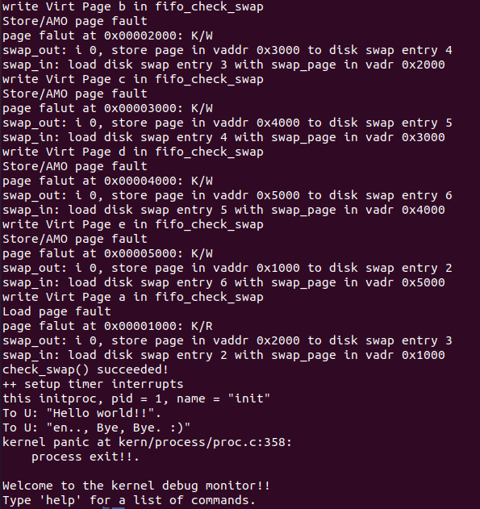
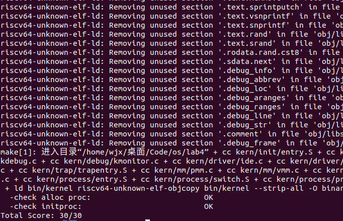
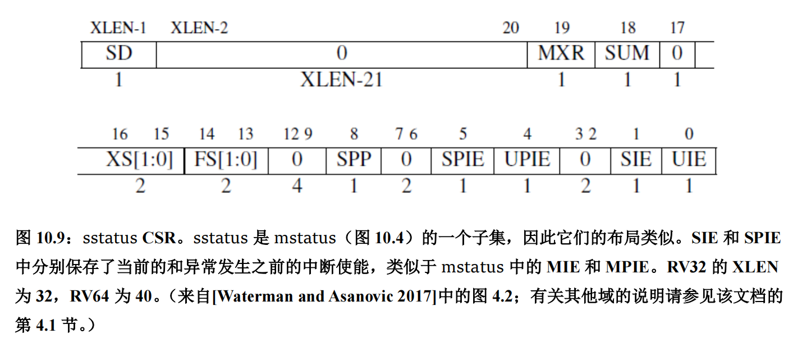

# <center>os-lab4 实验报告

## <center>组内人员与源码链接

- 2112495魏靖轩
- 2111822张浩龙
- 2113202刘子瑞

源码仓库：[Github](https://github.com/J1ngxuanWei/Operating-System/tree/main/lab4)

### <center>练习1：分配并初始化一个进程控制块（需要编码）

这里要求我们完成一个 alloc_proc 函数来负责分配一个新的 struct proc_struct 结构，根据提示我们需要初始化一些变量。

实验框架中已经帮我们分配了内存空间了，也即调用`kmalloc`函数来申请一个`proc_struct`，因此我们需要做的其实就是给这个指针对应的`proc_struct`变量赋值即可。

```cpp
static struct proc_struct *
alloc_proc(void) {
    struct proc_struct *proc = kmalloc(sizeof(struct proc_struct));
    if (proc != NULL) {
    //LAB4:EXERCISE1 YOUR CODE
    /*
     * below fields in proc_struct need to be initialized
     *       enum proc_state state;                      // Process state
     *       int pid;                                    // Process ID
     *       int runs;                                   // the running times of Proces
     *       uintptr_t kstack;                           // Process kernel stack
     *       volatile bool need_resched;                 // bool value: need to be rescheduled to release CPU?
     *       struct proc_struct *parent;                 // the parent process
     *       struct mm_struct *mm;                       // Process's memory management field
     *       struct context context;                     // Switch here to run process
     *       struct trapframe *tf;                       // Trap frame for current interrupt
     *       uintptr_t cr3;                              // CR3 register: the base addr of Page Directroy Table(PDT)
     *       uint32_t flags;                             // Process flag
     *       char name[PROC_NAME_LEN + 1];               // Process name
     */
    proc->state = PROC_UNINIT;  //设置进程为未初始化状态
    proc->pid = -1;             //未初始化的的进程id为-1
    proc->runs = 0;             //初始化时间片
    proc->kstack = 0;           //内存栈的地址
    proc->need_resched = 0;     //是否需要调度设为不需要
    proc->parent = NULL;        //父节点设为空
    proc->mm = NULL;            //虚拟内存设为空
    memset(&(proc->context), 0, sizeof(struct context));//上下文的初始化
    proc->tf = NULL;            //中断帧指针置为空
    proc->cr3 = boot_cr3;       //页目录设为内核页目录表的基址
    proc->flags = 0;            //标志位
    memset(proc->name, 0, PROC_NAME_LEN);//进程名
    }
    return proc;
}
```

> 请说明 proc_struct 中 `struct context context` 和 `struct trapframe *tf` 成员变量含义和在本实验中的作用是啥？（提示通过看代码和编程调试可以判断出来）

首先不妨查看 struct context 结构体的定义，可以发现在结构体中存储这除了 eax 之外的所有通用寄存器以及 eip 的数值，这就提示我们这个线程控制块中的 context 很有可能是保存的线程运行的上下文信息；
  
接下来使用 find grep 命令查找在 ucore 中对 context 成员变量进行了设置的代码，总共可以发现两处，分别为 Swtich.S 和 proc.c 中的 copy_thread 函数中，在其他部分均没有发现对 context 的引用和定义（除了初始化）；那么根据 Swtich 中代码的语义，可以确定 context 变量的意义就在于内核线程之间进行切换的时候，将原先的线程运行的上下文保存下来这一作用。

那么为什么没有对 eax 进行保存呢？注意到在进行切换的时候调用了 switch_to 这一个函数，也就是说这个函数的里面才是线程之间切换的切换点，而在这个函数里面，由于 eax 是一个 caller-save 寄存器，并且在函数里 eax 的数值一直都可以在栈上找到对应，因此没有必要对其进行保存。

在 context 中保存着各种寄存器的内容，主要保存了前一个进程的现场（各个寄存器的状态），是进程切换的上下文内容，这是为了保存进程上下文，用于进程切换，为进程调度做准备。

在 ucore 中，所有的进程在内核中也是相对独立的。使用 context 保存寄存器的目的就在于在内核态中能够进行上下文之间的切换。实际利用 context 进行上下文切换的函数是在 kern/process/switch.S 中定义 switch_to 函数。

接下来同样在代码中寻找对 tf 变量进行了定义的地方，最后可以发现在 copy_thread 函数中对 tf 进行了设置，但是值得注意的是，在这个函数中，同时对 context 变量的 esp 和 eip 进行了设置。前者设置为 tf 变量的地址，后者设置为 forkret 这个函数的指针。接下来观察 forkret 函数，发现这个函数最终调用了 __trapret 进行中断返回，这样的话，tf 变量的作用就变得清晰起来了。

tf 变量的作用在于在构造出了新的线程的时候，如果要将控制权交给这个线程，是使用中断返回的方式进行的（跟lab1中切换特权级类似的技巧），因此需要构造出一个伪造的中断返回现场，也就是 trapframe，使得可以正确地将控制权转交给新的线程；具体切换到新的线程的做法为：

- 调用switch_to函数。
- 然后在该函数中进行函数返回，直接跳转到 forkret 函数。
- 最终进行中断返回函数 __trapret，之后便可以根据 tf 中构造的中断返回地址，切换到新的线程了。

trapframe 保存着用于特权级转换的栈 esp 寄存器，当进程发生特权级转换的时候，中断帧记录了进入中断时任务的上下文。当退出中断时恢复环境。

tf 是一个中断帧的指针，总是指向内核栈的某个位置：

* 当进程从用户空间跳到内核空间时，中断帧记录了进程在被中断前的状态。
* 当内核需要跳回用户空间时，需要调整中断帧以恢复让进程继续执行的各寄存器值。
* 除此之外，ucore 内核允许嵌套中断，因此为了保证嵌套中断发生时 tf 总是能够指向当前的 trapframe，ucore 在内核栈上维护了 tf 的链。

因此不难总结，内核态和用户态的转换首先是留下 sstatus和 ESP 的位置，然后调用中断，改中断栈里面的内容， 然后退出中断的时候跳到内核态中，最后将 ebp 赋给 esp 修复 esp 的位置。

### <center>练习2：为新创建的内核线程分配资源（需要编码）

alloc_proc 实质只是找到了一小块内存用以记录进程的必要信息，并没有实际分配这些资源，而这个练习完成的 do_fork 才是真正完成了资源分配的工作，当然，do_fork 也只是创建当前内核线程的一个副本，它们的执行上下文、代码、数据都一样，但是存储位置不同。 

根据提示及阅读源码可知，它完成的工作主要如下：

- 1、分配并初始化进程控制块（ alloc_proc 函数）;
- 2、分配并初始化内核栈，为内核进程（线程）建立栈空间（ setup_stack 函数）;
- 3、根据 clone_flag 标志复制或共享进程内存管理结构（ copy_mm 函数）;
- 4、设置进程在内核（将来也包括用户态）正常运行和调度所需的中断帧和执行上下文 （ copy_thread 函数）;
- 5、为进程分配一个 PID（ get_pid() 函数）;
- 6、把设置好的进程控制块放入 hash_list 和 proc_list 两个全局进程链表中;
- 7、自此，进程已经准备好执行了，把进程状态设置为“就绪”态;
- 8、设置返回码为子进程的 PID 号。

思路已经在上面给出了，代码实现如下：

```cpp
/* do_fork -     parent process for a new child process
 * @clone_flags: used to guide how to clone the child process
 * @stack:       the parent's user stack pointer. if stack==0, It means to fork a kernel thread.
 * @tf:          the trapframe info, which will be copied to child process's proc->tf
 */
int do_fork(uint32_t clone_flags, uintptr_t stack, struct trapframe *tf) {
    int ret = -E_NO_FREE_PROC; //尝试为进程分配内存
    struct proc_struct *proc; //定义新进程
    if (nr_process >= MAX_PROCESS) { //分配进程数大于 4096，返回
        goto fork_out; //返回
    }
    ret = -E_NO_MEM; //因内存不足而分配失败
    //LAB4:EXERCISE2 YOUR CODE
    /*
     * Some Useful MACROs, Functions and DEFINEs, you can use them in below implementation.
     * MACROs or Functions:
     *   alloc_proc:   create a proc struct and init fields (lab4:exercise1)
     *   setup_kstack: alloc pages with size KSTACKPAGE as process kernel stack
     *   copy_mm:      process "proc" duplicate OR share process "current"'s mm according clone_flags
     *                 if clone_flags & CLONE_VM, then "share" ; else "duplicate"
     *   copy_thread:  setup the trapframe on the  process's kernel stack top and
     *                 setup the kernel entry point and stack of process
     *   hash_proc:    add proc into proc hash_list
     *   get_pid:      alloc a unique pid for process
     *   wakeup_proc:  set proc->state = PROC_RUNNABLE
     * VARIABLES:
     *   proc_list:    the process set's list
     *   nr_process:   the number of process set
     */

    //    1. call alloc_proc to allocate a proc_struct
    //    2. call setup_kstack to allocate a kernel stack for child process
    //    3. call copy_mm to dup OR share mm according clone_flag
    //    4. call copy_thread to setup tf & context in proc_struct
    //    5. insert proc_struct into hash_list && proc_list
    //    6. call wakeup_proc to make the new child process RUNNABLE
    //    7. set ret vaule using child proc's pid
    if ((proc = alloc_proc()) == NULL) { //调用 alloc_proc() 函数申请内存块，如果失败，直接返回处理
        goto fork_out;//返回
    }

    proc->parent = current; //将子进程的父节点设置为当前进程

    if (setup_kstack(proc) != 0) { //调用 setup_stack() 函数为进程分配一个内核栈
        goto bad_fork_cleanup_proc; //返回
    }
    if (copy_mm(clone_flags, proc) != 0) { //调用 copy_mm() 函数复制父进程的内存信息到子进程
        goto bad_fork_cleanup_kstack; //返回
    }
    copy_thread(proc, stack, tf); //调用 copy_thread() 函数复制父进程的中断帧和上下文信息
    //将新进程添加到进程的 hash 列表中
    bool intr_flag;
    local_intr_save(intr_flag); //屏蔽中断，intr_flag 置为 1
    {
        proc->pid = get_pid(); //获取当前进程 PID
        hash_proc(proc); //建立 hash 映射
        list_add(&proc_list, &(proc->list_link)); //将进程加入到进程的链表中
        nr_process ++; //进程数加 1
    }
    local_intr_restore(intr_flag); //恢复中断

    wakeup_proc(proc); //一切就绪，唤醒子进程

    ret = proc->pid; //返回子进程的 pid
fork_out: //已分配进程数大于 4096
    return ret;

bad_fork_cleanup_kstack: //分配内核栈失败
    put_kstack(proc);
bad_fork_cleanup_proc:
    kfree(proc);
    goto fork_out;
}
```

> 请说明 ucore 是否做到给每个新 fork 的线程一个唯一的 id？请说明你的分析和理由。

> 可以做到。为了保证每个 fork 的线程给的 ID 唯一，调用 `get_pid()` 函数时，每次都是从进程控制块链表中找到合适的 ID。而线程的 PID 由 `get_pid` 函数产生，该函数中包含了两个静态变量 `last_pid` 以及 `next_safe`。`last_pid` 变量保存上一次分配的 PID，而 `next_safe` 和 `last_pid` 一起表示一段可以使用的 PID 取值范围 ( `last_pid` ,`next_safe`)，`last_pid` 和 `next_safe` 被初始化为 `MAX_PID`。每次调用 `get_pid` 时，除了确定一个可以分配的 PID 外，还需要确定 `next_safe` 来实现均摊以此优化时间复杂度，PID 的确定过程中会检查所有进程的 PID，来确保 PID 是唯一的。

具体我们还可以看 `get_pid()` 函数：

* 在该函数中使用到了两个静态的局部变量` next_safe` 和 `last_pid`，根据命名推测，在每次进入 `get_pid `函数的时候，这两个变量的数值之间的取值均是合法的 pid（也就是说没有被使用过），这样的话，如果有严格的 `next_safe` >` last_pid` + 1，那么久可以直接取 `last_pid `+ 1 作为新的 pid（需要` last_pid `没有超出` MAX_PID` 从而变成 1）；

* 如果在进入函数的时候，这两个变量之后没有合法的取值，也就是说` next_safe` >` last_pid` + 1 不成立，那么进入循环，在循环之中首先通过` if (proc->pid == last_pid)` 这一分支确保了不存在任何进程的` pid `与` last_pid `重合，然后再通过` if (proc->pid > last_pid && next_safe > proc->pid) `这一判断语句保证了不存在任何已经存在的` pid `满足`：last_pid < pid < next_safe`，这样就确保了最后能够找到这么一个满足条件的区间，获得合法的` pid`；

* 之所以在该函数中使用了如此曲折的方法，维护一个合法的` pid `的区间，是为了优化时间效率，如果简单的暴力的话，每次需要枚举所有的` pid`，并且遍历所有的线程，这就使得时间代价过大，并且不同的调用` get_pid` 函数的时候不能利用到先前调用这个函数的中间结果；

### <center>练习3：编写proc_run 函数（需要编码）

函数的思路在指导书中已经给出，代码如下：

```cpp
void proc_run(struct proc_struct *proc) {
    if (proc != current) { // 判断需要运行的线程是否已经运行着了
        bool intr_flag;
        struct proc_struct *prev = current, *next = proc;
        local_intr_save(intr_flag); // 关闭中断
        {
            current = proc; // 将当前进程换为 要切换到的进程
            lcr3(next->cr3); // 重新加载 cr3 寄存器(页目录表基址) 进行进程间的页表切换，修改当前的 cr3 寄存器成需要运行线程（进程）的页目录表
            switch_to(&(prev->context), &(next->context)); // 调用 switch_to 进行上下文的保存与切换，切换到新的线程
        }
        local_intr_restore(intr_flag);
    }
}
```

> 在本实验的执行过程中，创建且运行了几个内核线程？

总共创建了两个内核线程，分别为：

- idle_proc，为第 0 个内核线程，在完成新的内核线程的创建以及各种初始化工作之后，进入死循环，用于调度其他进程或线程；
- init_proc，被创建用于打印 "Hello World" 的线程。本次实验的内核线程，只用来打印字符串。

### <center>运行测试

我们执行`make qemu`结果如下：



随后执行`make grade`结果如下：



可以看到，结果是符合预期的，且最终的得分是满分。

### <center>扩展练习 Challenge：说明语句local_intr_save(intr_flag);....local_intr_restore(intr_flag);是如何实现开关中断的？

首先我们看函数的执行过程：首先是调用`local_intr_save(intr_flag)`，随后跳到函数`__intr_save`，最后跳到函数`intr_disable()`，我们不妨看一下这个函数：

```cpp
void intr_disable(void)
{
    clear_csr(sstatus,SSTATUS_SIE);
}
```

而`clear_csr()`函数就非常简单，就是清除寄存器的指定位，在这里，就是清除`sstatus`寄存器的`SIE`位，我们此时对照`RISC-V`手册，可以知道：

> 委托给 S 模式的任何中断都可以被 S 模式的软件屏蔽。sie（Supervisor Interrupt Enable，监管者中断使能）和 sip（Supervisor Interrupt Pending，监管者中断待处理）CSR是 S 模式的控制状态寄存器，他们是 mie 和 mip 的子集。它们有着和 M 模式下相同的布局，但在 sie 和 sip 中只有与由 mideleg 委托的中断对应的位才能读写。那些没有被委派的中断对应的位始终为零。



那么答案就比较明显了，我们清除了SIE位，相当于执行了 RISC-V 中预设的 S 模式的软件屏蔽，在此时的情况下，RISC-V系统不会再执行中断的相关检测和处理程序。

其实阅读手册，可以知道，只有SIE不为0的中断才会被识别为需要处理的中断，而那些SIE为0的中断其实是不会被系统所承认的，这样就实现了我们要屏蔽中断的过程。

最后是恢复中断的`local_intr_restore(intr_flag);`函数，其本质是最后调用`set_csr`函数，就是将我们上面清0的SIE位重新置为有效，这样就恢复了中断。
