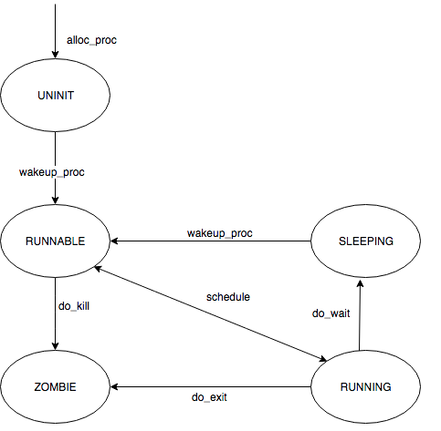
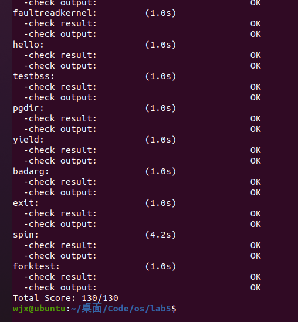

# <center>os-lab5 实验报告

## <center>组内人员与源码链接

- 2112495魏靖轩
- 2111822张浩龙
- 2113202刘子瑞

源码仓库：[Github](https://github.com/J1ngxuanWei/Operating-System/tree/main/lab5)

### <center>练习0：填写已有实验

按照要求将lab4代码填写之后，为了能够更好的实现lab5，需要做一定的改进。

根据查看注释要求，我们需要对部分代码进行改进，这里讲需要改进的地方的代码和说明罗列如下：

- 在 `alloc_proc` 函数中，额外对进程控制块中新增加的 `wait_state, cptr, yptr, optr` 成员变量进行初始化；
- 在 do_fork 函数中，使用 set_links 函数来完成将 fork 的线程添加到线程链表中的过程，值得注意的是，该函数中就包括了对进程总数加 1 这一操作，因此需要将原先的这个操作给删除掉；

#### alloc_proc() 函数

我们在原来的实验基础上，新增了 2 行代码：

```c
proc->wait_state = 0;//PCB 进程控制块中新增的条目，初始化进程等待状态  
proc->cptr = proc->optr = proc->yptr = NULL;//进程相关指针初始化
```

这两行代码主要是初始化进程等待状态、和进程的相关指针，例如父进程、子进程、同胞等等。新增的几个 proc 指针给出相关的解释如下：

```c
parent:           proc->parent  (proc is children)
children:         proc->cptr    (proc is parent)
older sibling:    proc->optr    (proc is younger sibling)
younger sibling:  proc->yptr    (proc is older sibling)
```

因为这里涉及到了用户进程，自然需要涉及到调度的问题，所以进程等待状态和各种指针需要被初始化。

所以改进后的 `alloc_proc` 函数如下：

```c
static struct proc_struct *alloc_proc(void) {
    struct proc_struct *proc = kmalloc(sizeof(struct proc_struct));
    if (proc != NULL) {
        proc->state = PROC_UNINIT;  //设置进程为未初始化状态
        proc->pid = -1;             //未初始化的的进程id为-1
        proc->runs = 0;             //初始化时间片
        proc->kstack = 0;           //内存栈的地址
        proc->need_resched = 0;     //是否需要调度设为不需要
        proc->parent = NULL;        //父节点设为空
        proc->mm = NULL;            //虚拟内存设为空
        memset(&(proc->context), 0, sizeof(struct context));//上下文的初始化
        proc->tf = NULL;            //中断帧指针置为空
        proc->cr3 = boot_cr3;       //页目录设为内核页目录表的基址
        proc->flags = 0;            //标志位
        memset(proc->name, 0, PROC_NAME_LEN);//进程名
        proc->wait_state = 0;//PCB 进程控制块中新增的条目，初始化进程等待状态  
        proc->cptr = proc->optr = proc->yptr = NULL;//进程相关指针初始化
    }
    return proc;
}
```

#### do_fork() 函数

我们在原来的实验基础上，新增了 2 行代码：

```c
assert(current->wait_state == 0); //确保当前进程正在等待
set_links(proc); //将原来简单的计数改成来执行 set_links 函数，从而实现设置进程的相关链接 
```

第一行是为了确定当前的进程正在等待，我们在 alloc_proc 中初始化 wait_state 为0。第二行是将原来的计数换成了执行一个 `set_links` 函数，因为要涉及到进程的调度，所以简单的计数肯定是不行的。

我们可以看看 set_links 函数：

```c
static void set_links(struct proc_struct *proc) {
    list_add(&proc_list,&(proc->list_link));//进程加入进程链表
    proc->yptr = NULL; //当前进程的 younger sibling 为空
    if ((proc->optr = proc->parent->cptr) != NULL) {
        proc->optr->yptr = proc; //当前进程的 older sibling 为当前进程
    }
    proc->parent->cptr = proc; //父进程的子进程为当前进程
    nr_process ++; //进程数加一
}
```

可以看出，set_links 函数的作用是设置当前进程的 process relations。

所以改进后的 `do_fork` 函数如下：

```c
int do_fork(uint32_t clone_flags, uintptr_t stack, struct trapframe *tf) {
    int ret = -E_NO_FREE_PROC; //尝试为进程分配内存
    struct proc_struct *proc; //定义新进程
    if (nr_process >= MAX_PROCESS) { //分配进程数大于 4096，返回
        goto fork_out; //返回
    }
    ret = -E_NO_MEM; //因内存不足而分配失败
    if ((proc = alloc_proc()) == NULL) { //调用 alloc_proc() 函数申请内存块，如果失败，直接返回处理
        goto fork_out;//返回
    }

    proc->parent = current; //将子进程的父节点设置为当前进程
    assert(current->wait_state == 0); //确保当前进程正在等待
  
    if (setup_kstack(proc) != 0) { //调用 setup_stack() 函数为进程分配一个内核栈
        goto bad_fork_cleanup_proc; //返回
    }
    if (copy_mm(clone_flags, proc) != 0) { //调用 copy_mm() 函数复制父进程的内存信息到子进程
        goto bad_fork_cleanup_kstack; //返回
    }
    copy_thread(proc, stack, tf); //调用 copy_thread() 函数复制父进程的中断帧和上下文信息
    //将新进程添加到进程的 hash 列表中
    bool intr_flag;
    local_intr_save(intr_flag); //屏蔽中断，intr_flag 置为 1
    {
        proc->pid = get_pid(); //获取当前进程 PID
        hash_proc(proc); //建立 hash 映射
        set_links(proc);//将原来简单的计数改成来执行set_links函数，从而实现设置进程的相关链接
    }
    local_intr_restore(intr_flag); //恢复中断

    wakeup_proc(proc); //一切就绪，唤醒子进程

    ret = proc->pid; //返回子进程的 pid
fork_out: //已分配进程数大于 4096
    return ret;

bad_fork_cleanup_kstack: //分配内核栈失败
    put_kstack(proc);
bad_fork_cleanup_proc:
    kfree(proc);
    goto fork_out;
}
```

### <center>练习1: 加载应用程序并执行（需要编码）

根据实验说明书，我们需要完善的函数是 load_icode 函数。

这里介绍下这个函数的功能：load_icode 函数主要用来被 do_execve 调用，将执行程序加载到进程空间（执行程序本身已从磁盘读取到内存中），给用户进程建立一个能够让用户进程正常运行的用户环境。这涉及到修改页表、分配用户栈等工作。 

该函数主要完成的工作如下：

- 1、调用 mm_create 函数来申请进程的内存管理数据结构 mm 所需内存空间,并对 mm 进行初始化;

- 2、调用 setup_pgdir 来申请一个页目录表所需的一个页大小的内存空间，并把描述 ucore 内核虚空间映射的内核页表( boot_pgdir 所指)的内容拷贝到此新目录表中，最后让 mm->pgdir 指向此页目录表，这就是进程新的页目录表了，且能够正确映射内核虚空间;

- 3、根据可执行程序的起始位置来解析此 ELF 格式的执行程序，并调用 mm_map 函数根据 ELF 格式执行程序的各个段(代码段、数据段、BSS 段等)的起始位置和大小建立对应的 vma 结构，并把 vma 插入到 mm 结构中，表明这些是用户进程的合法用户态虚拟地址空间;

- 4、根据可执行程序各个段的大小分配物理内存空间，并根据执行程序各个段的起始位置确定虚拟地址，并在页表中建立好物理地址和虚拟地址的映射关系，然后把执行程序各个段的内容拷贝到相应的内核虚拟地址中，至此应用程序执行码和数据已经根据编译时设定地址放置到虚拟内存中了;

- 5、需要给用户进程设置用户栈，为此调用 mm_mmap 函数建立用户栈的 vma 结构,明确用户栈的位置在用户虚空间的顶端，大小为 256 个页，即 1MB，并分配一定数量的物理内存且建立好栈的虚地址<-->物理地址映射关系;

- 6、至此，进程内的内存管理 vma 和 mm 数据结构已经建立完成，于是把 mm->pgdir 赋值到 cr3 寄存器中，即更新了用户进程的虚拟内存空间，此时的 init 已经被 exit 的代码和数据覆盖，成为了第一个用户进程，但此时这个用户进程的执行现场还没建立好;

- 7、先清空进程的中断帧,再重新设置进程的中断帧，使得在执行中断返回指令 iret 后，能够让 CPU 转到用户态特权级，并回到用户态内存空间，使用用户态的代码段、数据段和堆栈，且能够跳转到用户进程的第一条指令执行，并确保在用户态能够响应中断;

简单的说，该 load_icode 函数的主要工作就是给用户进程建立一个能够让用户进程正常运行的用户环境。

该函数的功能主要分为 6 个部分，而我们需要填写的是第 6 个部分，就是伪造中断返回现场，使得系统调用返回之后可以正确跳转到需要运行的程序入口，并正常运行；而 1-5 部分则是一系列对用户内存空间的初始化；第 6 个部分是在进行中断处理的栈（此时应当是内核栈）上伪造一个中断返回现场，使得中断返回的时候可以正确地切换到需要的执行程序入口处；在这个部分中需要对 tf 进行设置，不妨通过代码分析来确定这个 tf 变量究竟指到什么位置，该 tf 变量与 current->tf 的数值一致，而 current->tf 是在进行中断服务里程的 trap 函数中被设置为当前中断的中断帧，也就是说这个 tf 最终指向了当前系统调用 exec 产生的中断帧处；

* 因此实现思路为：
  1. gpr.sp 应当指向先前的步骤中创建的用户栈的栈顶；
  2. epc 应当指向 ELF 可执行文件加载到内存之后的入口处；
  3. status 应当sstatus

代码如下：

```c
tf->gpr.sp=USTACKTOP;
tf->epc=elf->e_entry;
tf->status==sstatus&(~(SSTATUS_SPP|SSTATUS_SPIE));;
```

> 请在实验报告中描述当创建一个用户态进程并加载了应用程序后，CPU 是如何让这个应用程序最终在用户态执行起来的。即这个用户态进程被 ucore 选择占用 CPU 执行（RUNNING 态）到具体执行应用程序第一条指令的整个经过。

分析在创建了用户态进程并且加载了应用程序之后，其占用 CPU 执行到具体执行应用程序的整个经过：

  1. 在经过调度器占用了 CPU 的资源之后，用户态进程调用了 exec 系统调用，从而转入到了系统调用的处理例程；
  
  2. 在经过了正常的中断处理例程之后，最终控制权转移到了 syscall.c 中的 syscall 函数，然后根据系统调用号转移给了 sys_exec 函数，在该函数中调用了上文中提及的 do_execve 函数来完成指定应用程序的加载；
  
  3. 在do_execve中进行了若干设置，包括推出当前进程的页表，换用 kernel 的 PDT 之后，使用 load_icode 函数，完成了对整个用户线程内存空间的初始化，包括堆栈的设置以及将 ELF 可执行文件的加载，之后通过 current->tf 指针修改了当前系统调用的 trapframe，使得最终中断返回的时候能够切换到用户态，并且同时可以正确地将控制权转移到应用程序的入口处；

  4. 在完成了 do_exec 函数之后，进行正常的中断返回的流程，由于中断处理例程的栈上面的 epc 已经被修改成了应用程序的入口处，而 CS 上的 CPL 是用户态，因此 iret 进行中断返回的时候会将堆栈切换到用户的栈，并且完成特权级的切换，并且跳转到要求的应用程序的入口处；

  5. 接下来开始具体执行应用程序的第一条指令；

### <center>练习2: 父进程复制自己的内存空间给子进程（需要编码）

这个工作的执行是由 do_fork 函数完成，具体是调用 copy_range 函数，而这里我们的任务就是补全这个函数。 

这个具体的调用过程是由 do_fork 函数调用 copy_mm 函数，然后 copy_mm 函数调用 dup_mmap 函数，最后由这个 dup_mmap 函数调用 copy_range 函数。即 `do_fork()---->copy_mm()---->dup_mmap()---->copy_range()`。

在了解了上面的这些函数之后，实现思路就比较简单了：

* 实现思路：
copy_range 函数的具体执行流程是遍历父进程指定的某一段内存空间中的每一个虚拟页，如果这个虚拟页是存在的话，为子进程对应的同一个地址（但是页目录表是不一样的，因此不是一个内存空间）也申请分配一个物理页，然后将前者中的所有内容复制到后者中去，然后为子进程的这个物理页和对应的虚拟地址（事实上是线性地址）建立映射关系；而在本练习中需要完成的内容就是内存的复制和映射的建立，具体流程如下：
  1. 找到父进程指定的某一物理页对应的内核虚拟地址；
  2. 找到需要拷贝过去的子进程的对应物理页对应的内核虚拟地址；
  3. 将前者的内容拷贝到后者中去；
  4. 为子进程当前分配这一物理页映射上对应的在子进程虚拟地址空间里的一个虚拟页；

代码如下：

```c
        void * kva_src = page2kva(page); // 找到父进程需要复制的物理页在内核地址空间中的虚拟地址，这是由于这个函数执行的时候使用的时内核的地址空间
        void * kva_dst = page2kva(npage); // 找到子进程需要被填充的物理页的内核虚拟地址
        memcpy(kva_dst, kva_src, PGSIZE); // 将父进程的物理页的内容复制到子进程中去
        ret = page_insert(to, npage, start, perm); // 建立子进程的物理页与虚拟页的映射关系
```

> 请在实验报告中简要说明如何设计实现 ”Copy on Write 机制“，给出概要设计，鼓励给出详细设计。

接下来将说明如何实现 “Copy on Write” 机制，该机制的主要思想为使得进程执行 fork 系统调用进行复制的时候，父进程不会简单地将整个内存中的内容复制给子进程，而是暂时共享相同的物理内存页；而当其中一个进程需要对内存进行修改的时候，再额外创建一个自己私有的物理内存页，将共享的内容复制过去，然后在自己的内存页中进行修改；根据上述分析，主要对实验框架的修改应当主要有两个部分，一个部分在于进行 fork 操作的时候不直接复制内存，另外一个处理在于出现了内存页访问异常的时候，会将共享的内存页复制一份，然后在新的内存页进行修改，具体的修改部分如下：

- do fork 部分：在进行内存复制的部分，比如 copy_range 函数内部，不实际进行内存的复制，而是将子进程和父进程的虚拟页映射上同一个物理页面，然后在分别在这两个进程的虚拟页对应的 PTE 部分将这个页置成是不可写的，同时利用 PTE 中的保留位将这个页设置成共享的页面，这样的话如果应用程序试图写某一个共享页就会产生页访问异常，从而可以将控制权交给操作系统进行处理；

- page fault 部分：在 page fault 的 ISR 部分，新增加对当前的异常是否由于尝试写了某一个共享页面引起的，如果是的话，额外申请分配一个物理页面，然后将当前的共享页的内容复制过去，建立出错的线性地址与新创建的物理页面的映射关系，将 PTE 设置设置成非共享的；然后查询原先共享的物理页面是否还是由多个其它进程共享使用的，如果不是的话，就将对应的虚地址的 PTE 进行修改，删掉共享标记，恢复写标记；这样的话 page fault 返回之后就可以正常完成对虚拟内存（原想的共享内存）的写操作了；

上述实现有一个较小的缺陷，在于在 do fork 的时候需要修改所有的 PTE，会有一定的时间效率上的损失；可以考虑将共享的标记加在 PDE 上，然后一旦访问了这个 PDE 之后再将标记下传给对应的 PTE，这样的话就起到了标记延迟和潜在的标记合并的左右，有利于提升时间效率；

### <center>练习3: 阅读分析源代码，理解进程执行 fork/exec/wait/exit 的实现，以及系统调用的实现（不需要编码）

一般来说，用户进程只能执行一般的指令,无法执行特权指令。采用系统调用机制为用户进程提供一个获得操作系统服务的统一接口层，简化用户进程的实现。 

根据之前的分析，应用程序调用的 exit/fork/wait/getpid 等库函数最终都会调用 syscall 函数，只是调用的参数不同而已（分别是 SYS_exit / SYS_fork / SYS_wait / SYS_getid ）

当应用程序调用系统函数时，一般执行 INT T_SYSCALL 指令后，CPU 根据操作系统建立的系统调用中断描述符，转入内核态，然后开始了操作系统系统调用的执行过程，在内核函数执行之前，会保留软件执行系统调用前的执行现场，然后保存当前进程的 tf 结构体中，之后操作系统就可以开始完成具体的系统调用服务，完成服务后，调用 IRET 返回用户态，并恢复现场。这样整个系统调用就执行完毕了。


首先我们可以罗列下目前 ucore 所有的系统调用，如下表所示：

| **系统调用名** | **含义**                               | **具体完成服务的函数**                                       |
| -------------- | -------------------------------------- | ------------------------------------------------------------ |
| SYS_exit       | process exit                           | do_exit                                                      |
| SYS_fork       | create child process, dup mm           | do_fork->wakeup_proc                                         |
| SYS_wait       | wait process                           | do_wait                                                      |
| SYS_exec       | after fork, process execute a program  | load a program and refresh the mm                            |
| SYS_clone      | create child thread                    | do_fork->wakeup_proc                                         |
| SYS_yield      | process flag itself need resecheduling | proc->need_sched=1, then scheduler will rescheule this process |
| SYS_sleep      | process sleep                          | do_sleep                                                     |
| SYS_kill       | kill process                           | do_kill->proc->flags \|= PF_EXITING->wakeup_proc->do_wait->do_exit |
| SYS_getpid     | get the process's pid                  |                                                              |

接下来对 fork/exec/wait/exit 四个系统调用进行分析：

#### fork

调用过程为：`fork->SYS_fork->do_fork+wakeup_proc`。

首先当程序执行 fork 时，fork 使用了系统调用 SYS_fork，而系统调用 SYS_fork 则主要是由 do_fork 和 wakeup_proc 来完成的。do_fork() 完成的工作在练习 2 及 lab4 中已经做过详细介绍，这里再简单说一下，主要是完成了以下工作：

- 1、分配并初始化进程控制块（ alloc_proc 函数）;
- 2、分配并初始化内核栈，为内核进程（线程）建立栈空间（ setup_stack 函数）;
- 3、根据 clone_flag 标志复制或共享进程内存管理结构（ copy_mm 函数）;
- 4、设置进程在内核（将来也包括用户态）正常运行和调度所需的中断帧和执行上下文 （ copy_thread 函数）;
- 5、为进程分配一个 PID（ get_pid() 函数）;
- 6、把设置好的进程控制块放入 hash_list 和 proc_list 两个全局进程链表中;
- 7、自此，进程已经准备好执行了，把进程状态设置为“就绪”态;
- 8、设置返回码为子进程的 PID 号。

而 wakeup_proc 函数主要是将进程的状态设置为等待，即 proc->wait_state = 0。

#### exec

调用过程为：`SYS_exec->do_execve`。

当应用程序执行的时候，会调用 SYS_exec 系统调用，而当 ucore 收到此系统调用的时候，则会使用 do_execve() 函数来实现，因此这里我们主要介绍 do_execve() 函数的功能，函数主要时完成用户进程的创建工作，同时使用户进程进入执行。 

主要工作如下：

- 1、首先为加载新的执行码做好用户态内存空间清空准备。如果 mm 不为 NULL，则设置页表为内核空间页表，且进一步判断 mm 的引用计数减 1 后是否为 0，如果为 0，则表明没有进程再需要此进程所占用的内存空间，为此将根据 mm 中的记录，释放进程所占用户空间内存和进程页表本身所占空间。最后把当前进程的 mm 内存管理指针为空。

- 2、接下来是加载应用程序执行码到当前进程的新创建的用户态虚拟空间中。之后就是调用 load_icode 从而使之准备好执行。（具体 load_icode 的功能在练习 1 已经介绍的很详细了，这里不赘述了）

#### wait

调用过程为：`SYS_wait->do_wait`。

当执行 wait 功能的时候，会调用系统调用 SYS_wait，而该系统调用的功能则主要由 do_wait 函数实现，主要工作就是父进程如何完成对子进程的最后回收工作，具体的功能实现如下：

- 1、 如果 pid!=0，表示只找一个进程 id 号为 pid 的退出状态的子进程，否则找任意一个处于退出状态的子进程;

- 2、 如果此子进程的执行状态不为 PROC_ZOMBIE，表明此子进程还没有退出，则当前进程设置执行状态为 PROC_SLEEPING（睡眠），睡眠原因为 WT_CHILD (即等待子进程退出)，调用 schedule() 函数选择新的进程执行，自己睡眠等待，如果被唤醒，则重复跳回步骤 1 处执行;

- 3、 如果此子进程的执行状态为 PROC_ZOMBIE，表明此子进程处于退出状态，需要当前进程(即子进程的父进程)完成对子进程的最终回收工作，即首先把子进程控制块从两个进程队列 proc_list 和 hash_list 中删除，并释放子进程的内核堆栈和进程控制块。自此，子进程才彻底地结束了它的执行过程，它所占用的所有资源均已释放。

#### exit

调用过程为：`SYS_exit->exit`。

当执行 exit 功能的时候，会调用系统调用 SYS_exit，而该系统调用的功能主要是由 do_exit 函数实现。具体过程如下：

- 1、先判断是否是用户进程，如果是，则开始回收此用户进程所占用的用户态虚拟内存空间;（具体的回收过程不作详细说明）

- 2、设置当前进程的中hi性状态为 PROC_ZOMBIE，然后设置当前进程的退出码为 error_code。表明此时这个进程已经无法再被调度了，只能等待父进程来完成最后的回收工作（主要是回收该子进程的内核栈、进程控制块）

- 3、如果当前父进程已经处于等待子进程的状态，即父进程的 wait_state 被置为 WT_CHILD，则此时就可以唤醒父进程，让父进程来帮子进程完成最后的资源回收工作。

- 4、如果当前进程还有子进程,则需要把这些子进程的父进程指针设置为内核线程 init，且各个子进程指针需要插入到 init 的子进程链表中。如果某个子进程的执行状态是 PROC_ZOMBIE，则需要唤醒 init 来完成对此子进程的最后回收工作。

- 5、执行 schedule() 调度函数，选择新的进程执行。

所以说该函数的功能简单的说就是，回收当前进程所占的大部分内存资源,并通知父进程完成最后的回收工作。

> 请分析fork/exec/wait/exit的执行流程。重点关注哪些操作是在用户态完成，哪些是在内核态完成？内核态与用户态程序是如何交错执行的？内核态执行结果是如何返回给用户程序的？

- 用户态程序调用sys_fork()系统调用，通过syscall进入内核态。
- 内核态处理sys_fork()系统调用，调用do_fork()函数创建子进程，完成后返回到用户态。

- 用户态程序调用sys_exit()系统调用，通过syscall进入内核态。
- 内核态处理sys_exit()系统调用，调用do_exit()函数结束当前进程，最终返回到用户态。

- 用户态程序调用sys_exec()系统调用，通过syscall进入内核态。
- 内核态处理sys_exec()系统调用，调用do_execve()函数加载新的程序，但由于当前是在S mode下，无法直接进行上下文切换。因此使用ebreak产生断点中断，转发到syscall()函数，在该函数中完成上下文切换，最终返回到用户态。

- 用户态程序调用sys_wait()系统调用，通过syscall进入内核态。
- 内核态处理sys_wait()系统调用，调用do_wait()函数等待子进程退出，完成后返回到用户态。

> 请给出 ucore 中一个用户态进程的执行状态生命周期图（包执行状态，执行状态之间的变换关系，以及产生变换的事件或函数调用）。（字符方式画即可）

生命周期图如下：



### <center>扩展练习 Challenge 2 ：说明该用户程序是何时被预先加载到内存中的？与我们常用操作系统的加载有何区别，原因是什么？

本次实验中，用户程序是在执行 `execve` 系统调用时被预先加载到内存中的。与我们常用的操作系统加载过程的区别主要在于执行上述加载步骤的时机。在常用的操作系统中，用户程序通常在运行时（runtime）才被加载到内存。当用户启动程序或运行可执行文件时，操作系统负责将程序从磁盘加载到内存，然后执行。这么做的原因是简化用户程序执行过程：预先加载用户程序可以简化用户程序的执行过程，使得执行过程更加直接和快速。

### <center>实验结果

执行`make grade`结果如下：



### <center>知识点总结

#### 系统调用

用户程序在用户态运行(U mode), 系统调用在内核态执行(S mode)。涉及CPU特权级切换的过程，`ecall `可以从U到S。S mode调用 `OpenSBI `提供的 M mode 接口。用 `ecall `调用进入M mode，剩下的事情交给底层的OpenSBI来完成。

#### 内核线程到用户进程

各个内核线程间的配合是较为协调的，能够相互考虑各自的资源利用情况，从而可以在适当的时候使用或不使用资源。而用户进程则相对利己，只考虑自身的资源利用情况，所以需要操作系统管理它们，让有效的资源得到协调而安全的利用。

#### 用户态进程的执行过程

用户进程执行过程中，会发生系统调用、外部中断等造成特权级切换的情况，这时执行的进程到底是什么级别的进程呢？

从进程控制块（PCB）的角度理解，当PCB发生变化时、即执行了进程执行现场的切换，就认为是进程的分界点，因此可以把执行应用程序的代码一直到执行操作系统中的进程切换处为止都认为是一个应用程序的执行过程。

从指令执行/逻辑功能的角度理解，就需要进一步的分类讨论。对于用户进程主动的切换行为（如系统调用），进程代码包括用户和内核两部分。而对于用户进程被动的切换行为（如外设中断和CPU执行异常），切换后的代码逻辑对用户程序而言不可见，因此是另外一段执行逻辑。
