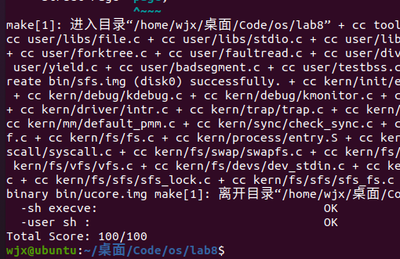

# <center>os-lab8 实验报告

## <center>组内人员与源码链接

- 2112495魏靖轩
- 2111822张浩龙
- 2113202刘子瑞

源码仓库：[Github](https://github.com/J1ngxuanWei/Operating-System/tree/main/lab8)

### <center>练习1: 完成读文件操作的实现（需要编码）

要求是首先了解打开文件的处理流程，然后参考本实验后续的文件读写操作的过程分析，编写在 sfs_inode.c 中 sfs_io_nolock 读文件中数据的实现代码。 

ucore 的文件系统模型源于 Havard 的 OS161 的文件系统和 Linux 文件系统。但其实这二者都是源于传统的 UNIX 文件系统设计。UNIX 提出了四个文件系统抽象概念：文件(file)、目录项(dentry)、索引节点(inode)和安装点(mount point)。

- 文件：UNIX 文件中的内容可理解为是一有序字节 buffer，文件都有一个方便应用程序识别的文件名称（也称文件路径名）。典型的文件操作有读、写、创建和删除等。

- 目录项：目录项不是目录，而是目录的组成部分。在 UNIX 中目录被看作一种特定的文件，而目录项是文件路径中的一部分。如一个文件路径名是 “/test/testfile”，则包含的目录项为：根目录 “/”，目录 “test” 和文件 “testfile”，这三个都是目录项。一般而言，目录项包含目录项的名字（文件名或目录名）和目录项的索引节点（见下面的描述）位置。

- 索引节点：UNIX 将文件的相关元数据信息（如访问控制权限、大小、拥有者、创建时间、数据内容等等信息）存储在一个单独的数据结构中，该结构被称为索引节点。 

- 安装点：在 UNIX 中，文件系统被安装在一个特定的文件路径位置，这个位置就是安装点。所有的已安装文件系统都作为根文件系统树中的叶子出现在系统中。安装点是一个起点，从安装点开始可以访问文件系统中的所有文件。

其中，文件和目录是给应用程序看到的一个抽象。

从 ucore 操作系统不同的角度来看，ucore 中的文件系统架构包含四类主要的数据结构, 它们分别是：

- 1、超级块（SuperBlock），它主要从文件系统的全局角度描述特定文件系统的全局信息。它的作用范围是整个OS空间。 

- 2、索引节点（inode）：它主要从文件系统的单个文件的角度它描述了文件的各种属性和数据所在位置。它的作用范围是整个OS空间。 

- 3、目录项（dentry）：它主要从文件系统的文件路径的角度描述了文件路径中的特定目录。它的作用范围是整个 OS 空间。 

- 4、文件（file），它主要从进程的角度描述了一个进程在访问文件时需要了解的文件标识，文件读写的位置，文件引用情况等信息。它的作用范围是某一具体进程。

文件系统，会将磁盘上的文件（程序）读取到内存里面来，在用户空间里面变成进程去进一步执行或其他操作。通过一系列系统调用完成这个过程。

根据实验指导书，我们可以了解到，ucore 的文件系统架构主要由四部分组成：

- 通用文件系统访问接口层：该层提供了一个从用户空间到文件系统的标准访问接口。这一层访问接口让应用程序能够通过一个简单的接口获得 ucore 内核的文件系统服务。

- 文件系统抽象层：向上提供一个一致的接口给内核其他部分（文件系统相关的系统调用实现模块和其他内核功能模块）访问。向下提供一个抽象函数指针列表和数据结构来屏蔽不同文件系统的实现细节。

- Simple FS 文件系统层：一个基于索引方式的简单文件系统实例。向上通过各种具体函数实现以对应文件系统抽象层提出的抽象函数。向下访问外设接口

- 外设接口层：向上提供 device 访问接口屏蔽不同硬件细节。向下实现访问各种具体设备驱动的接口,比如 disk 设备接口/串口设备接口/键盘设备接口等。

接下来分析下打开一个文件的详细处理的流程。 

例如某一个应用程序需要操作文件（增删读写等），首先需要通过文件系统的通用文件系统访问接口层给用户空间提供的访问接口进入文件系统内部，接着由文件系统抽象层把访问请求转发给某一具体文件系统(比如 Simple FS 文件系统)，然后再由具体文件系统把应用程序的访问请求转化为对磁盘上的 block 的处理请求，并通过外设接口层交给磁盘驱动例程来完成具体的磁盘操作。

对应到我们的ucore上，具体的过程如下：

- 1、 以打开文件为例，首先用户会在进程中调用 safe_open() 函数，然后依次调用如下函数 open->sys_open->syscall，从而引发系统调用然后进入内核态，然后会由 sys_open 内核函数处理系统调用，进一步调用到内核函数 sysfile_open，然后将字符串 "/test/testfile" 拷贝到内核空间中的字符串 path 中，并进入到文件系统抽象层的处理流程完成进一步的打开文件操作中。
- 2、 在文件系统抽象层，系统会分配一个 file 数据结构的变量，这个变量其实是 current->fs_struct->filemap[] 中的一个空元素，即还没有被用来打开过文件，但是分配完了之后还不能找到对应对应的文件结点。所以系统在该层调用了 vfs_open 函数通过调用 vfs_lookup 找到 path 对应文件的 inode，然后调用vop_open函数打开文件。然后层层返回，通过执行语句 file->node=node;，就把当前进程的 current->fs_struct->filemap[fd]（即 file 所指变量）的成员变量 node 指针指向了代表文件的索引节点 node。这时返回 fd。最后完成打开文件的操作。

- 3、 在第2步中，调用了 SFS 文件系统层的 vfs_lookup 函数去寻找 node，这里在 sfs_inode.c 中我们能够知道 .vop_lookup = sfs_lookup。

- 4、看到 sfs_lookup 函数传入的三个参数，其中 node 是根目录“/”所对应的 inode 节点；path 是文件的绝对路径（例如“/test/file”)，而 node_store 是经过查找获得的 file 所对应的 inode 节点。 函数以“/”为分割符，从左至右逐一分解path获得各个子目录和最终文件对应的 inode 节点。在本例中是分解出 “test” 子目录，并调用 sfs_lookup_once 函数获得 “test” 子目录对应的 inode 节点 subnode，然后循环进一步调用  sfs_lookup_once 查找以 “test” 子目录下的文件 “testfile1” 所对应的 inode 节点。当无法分解 path 后，就意味着找到了testfile1对应的 inode 节点，就可顺利返回了。

- 5、而我们再进一步观察 sfs_lookup_once 函数，它调用 sfs_dirent_search_nolock 函数来查找与路径名匹配的目录项，如果找到目录项，则根据目录项中记录的 inode 所处的数据块索引值找到路径名对应的 SFS 磁盘 inode，并读入 SFS 磁盘 inode 对的内容，创建 SFS 内存 inode。 

ucore 文件系统中，是这样处理读写硬盘操作的：

- （1）首先是应用程序发出请求，请求硬盘中写数据或读数据，应用程序通过 FS syscall 接口执行系统调用，获得 ucore 操作系统关于文件的一些服务；

- （2）之后，一旦操作系统内系统调用得到了请求，就会到达 VFS 层面（虚拟文件系统），包含很多部分比如文件接口、目录接口等，是一个抽象层面，它屏蔽底层具体的文件系统；

- （3）VFS 如果得到了处理，那么 VFS 会将这个 iNode 传递给 SimpleFS，注意，此时，VFS 中的 iNode 还是一个抽象的结构，在 SimpleFS 中会转化为一个具体的 iNode；

- （4）通过该 iNode 经过 IO 接口对于磁盘进行读写。

上图所示的是一个 SFS 的文件系统，其定义在（kern/fs/sfs/sfs.h，83——94行）：

```c
struct sfs_fs {
    struct sfs_super super;              /* on-disk superblock */
    struct device *dev;                  /* device mounted on */
    struct bitmap *freemap;              /* blocks in use are mared 0 */
    bool super_dirty;                    /* true if super/freemap modified */
    void *sfs_buffer;                    /* buffer for non-block aligned io */
    semaphore_t fs_sem;                  /* semaphore for fs */
    semaphore_t io_sem;                  /* semaphore for io */
    semaphore_t mutex_sem;               /* semaphore for link/unlink and rename */
    list_entry_t inode_list;             /* inode linked-list */
    list_entry_t *hash_list;             /* inode hash linked-list */
};
```

其中，SFS 的前 3 项对应的就是硬盘文件布局的全局信息。

那么，接下来分析这些文件布局的数据结构：

（1）超级块 super_block（kern/fs/sfs/sfs.h，40——45行）

```c
struct sfs_super {
    uint32_t magic;                     /* magic number, should be SFS_MAGIC */
    uint32_t blocks;                    /* # of blocks in fs */
    uint32_t unused_blocks;             /* # of unused blocks in fs */
    char info[SFS_MAX_INFO_LEN + 1];    /* infomation for sfs  */
};
```

超级块，刚刚说过是一个文件系统的全局角度描述特定文件系统的全局信息。这里面定义了标识符 magic、总块数 blocks、空闲块数 unused_blocks 和一些关于 SFS 的信息，通常是字符串。

（2）根目录结构 root_dir（kern/fs/sfs/sfs.h，48——57行）

```c
struct sfs_disk_inode {
    uint32_t size;                       	/* size of the file (in bytes) */
    uint16_t type;                       	/* one of SYS_TYPE_* above */
    uint16_t nlinks;                     	/* # of hard links to this file */
    uint32_t blocks;                    	/* # of blocks */
    uint32_t direct[SFS_NDIRECT];        	/* direct blocks */
    uint32_t indirect;                    	/* indirect blocks */
};
```

我们刚刚讲过，iNode 是从文件系统的单个文件的角度它描述了文件的各种属性和数据所在位置，相当于一个索引，而 root_dir 是一个根目录索引，根目录表示，我们一开始访问这个文件系统可以看到的目录信息。主要关注 direct 和 indirect，代表根目录下的直接索引和间接索引。

（3）目录项 entry（kern/fs/sfs/sfs.h，60——63行）

```c
struct sfs_disk_entry {
    uint32_t ino;                              	/* inode number */
    char name[SFS_MAX_FNAME_LEN + 1];       	/* file name */
};
```

数组中存放的是文件的名字，ino 是该文件的 iNode 值。

仅有硬盘文件布局还不够，SFS 毕竟是一个在硬盘之上的抽象，它还需要传递上一层过来的索引值 INODE。这个 INODE 是 SFS 层面的，我们刚刚讨论的 iNode 是硬盘上实际的索引。

sfs_inode（kern/fs/sfs/sfs.h，69——77行）

```c
struct sfs_inode {
    struct sfs_disk_inode *din;             /* on-disk inode */
    uint32_t ino;                           /* inode number */
    bool dirty;                             /* true if inode modified */
    int reclaim_count;                      /* kill inode if it hits zero */
    semaphore_t sem;                        /* semaphore for din */
    list_entry_t inode_link;                /* entry for linked-list in sfs_fs */
    list_entry_t hash_link;                 /* entry for hash linked-list in sfs_fs */
};
```

我们看到，sfs_disk_inode 是 SFS 层面上的 iNode 的一个成员，代表了这两个结构之间的上下级关系。

接下来，我们来分析更高层的数据结构 VFS（虚拟文件系统）。


在 VFS 层中，我们需要对于虚拟的 iNode，和下一层的 SFS 的 iNode 进行对接。

文件系统抽象层是把不同文件系统的对外共性接口提取出来，形成一个函数指针数组，这样，通用文件系统访问接口层只需访问文件系统抽象层，而不需关心具体文件系统的实现细节和接口。

（1）VFS的抽象定义（kern/fs/vfs/vfs.h，35——46行）

```c
struct fs {
    union {
        struct sfs_fs __sfs_info;                   
    } fs_info;                              	    // filesystem-specific data 
    enum {
        fs_type_sfs_info,
    } fs_type;                               	    // filesystem type 
    int (*fs_sync)(struct fs *fs);                 	// Flush all dirty buffers to disk 
    struct inode *(*fs_get_root)(struct fs *fs);   	// Return root inode of filesystem.
    int (*fs_unmount)(struct fs *fs);             	// Attempt unmount of filesystem.
    void (*fs_cleanup)(struct fs *fs);            	// Cleanup of filesystem.??? 
};
```

主要是一些函数指针用于处理 VFS 的操作。

（2）文件结构（kern/fs/file.c，14——24行）

```c
struct file {
    enum {
        FD_NONE, FD_INIT, FD_OPENED, FD_CLOSED,
    } status;                    //访问文件的执行状态
    bool readable;               //文件是否可读
    bool writable;               //文件是否可写
    int fd;                      //文件在 filemap 中的索引值
    off_t pos;                   //访问文件的当前位置
    struct inode *node;          //该文件对应的内存 inode 指针
    atomic_t open_count;         //打开此文件的次数
};
```

在 file 基础之上还有一个管理所有 file 的数据结构 file_struct（kern/fs/fs.h，25——30行）

```c
struct files_struct {
    struct inode *pwd;      	//当前工作目录
    struct file *fd_array;      //已经打开的文件对应的数组
    int files_count;        	//打开的文件个数
};
```

（3）VFS 的索引 iNode（kern/fs/vfs/inode.h，29——42行）

```c
/*
inode 数据结构是位于内存的索引节点，把不同文件系统的特定索引节点信息(甚至不能算是一个索引节点)统一封装起来，避免了进程直接访问具体文件系统
*/
struct inode {
    union {                                  //包含不同文件系统特定 inode 信息的 union 域
        struct device __device_info;         //设备文件系统内存 inode 信息
        struct sfs_inode __sfs_inode_info;   //SFS 文件系统内存 inode 信息
    } in_info;
    enum {
        inode_type_device_info = 0x1234,
        inode_type_sfs_inode_info,
    } in_type;                               //此 inode 所属文件系统类型
    atomic_t ref_count;                      //此 inode 的引用计数
    atomic_t open_count;                     //打开此 inode 对应文件的个数
    struct fs *in_fs;                        //抽象的文件系统,包含访问文件系统的函数指针
    const struct inode_ops *in_ops;          //抽象的 inode 操作,包含访问 inode 的函数指针
};
```

我们看到在 VFS 层面的 iNode 值，包含了 SFS 和硬件设备 device 的情况。

（4）inode 的操作函数指针列表（kern/fs/vfs/inode.h，169——186行）

```c
struct inode_ops {
    unsigned long vop_magic;
    int (*vop_open)(struct inode *node, uint32_t open_flags);
    int (*vop_close)(struct inode *node);
    int (*vop_read)(struct inode *node, struct iobuf *iob);
    int (*vop_write)(struct inode *node, struct iobuf *iob);
    int (*vop_fstat)(struct inode *node, struct stat *stat);
    int (*vop_fsync)(struct inode *node);
    int (*vop_namefile)(struct inode *node, struct iobuf *iob);
    int (*vop_getdirentry)(struct inode *node, struct iobuf *iob);
    int (*vop_reclaim)(struct inode *node);
    int (*vop_gettype)(struct inode *node, uint32_t *type_store);
    int (*vop_tryseek)(struct inode *node, off_t pos);
    int (*vop_truncate)(struct inode *node, off_t len);
    int (*vop_create)(struct inode *node, const char *name, bool excl, struct inode **node_store);
    int (*vop_lookup)(struct inode *node, char *path, struct inode **node_store);
    int (*vop_ioctl)(struct inode *node, int op, void *data);
};
```

inode_ops 是对常规文件、目录、设备文件所有操作的一个抽象函数表示。对于某一具体的文件系统中的文件或目录，只需实现相关的函数，就可以被用户进程访问具体的文件了，且用户进程无需了解具体文件系统的实现细节。

有了上述分析后，我们可以看看如果一个用户进程打开文件会做哪些事情？

首先假定用户进程需要打开的文件已经存在在硬盘上。以 user/sfs_filetest1.c 为例，首先用户进程会调用在 main 函数中的如下语句：

```c
int fd1 = safe_open("/test/testfile", O_RDWR | O_TRUNC);
```

如果 ucore 能够正常查找到这个文件，就会返回一个代表文件的文件描述符 fd1，这样在接下来的读写文件过程中，就直接用这样 fd1 来代表就可以了。

接下来实现需要编码的函数：

通用文件访问接口层的处理流程：

首先进入通用文件访问接口层的处理流程，即进一步调用如下用户态函数：open->sys_open->syscall，从而引起系统调用进入到内核态。到了内核态后，通过中断处理例程，会调用到 sys_open 内核函数，并进一步调用 sysfile_open 内核函数。到了这里，需要把位于用户空间的字符串 ”/test/testfile” 拷贝到内核空间中的字符串  path 中，并进入到文件系统抽象层的处理流程完成进一步的打开文件操作中。


文件系统抽象层（VFS）的处理流程：

1、分配一个空闲的 file 数据结构变量 file 在文件系统抽象层的处理中，首先调用的是 file_open 函数，它要给这个即将打开的文件分配一个 file 数据结构的变量，这个变量其实是当前进程的打开文件数组 current->fs_struct->filemap[] 中的一个空闲元素（即还没用于一个打开的文件），而这个元素的索引值就是最终要返回到用户进程并赋值给变量 fd1。到了这一步还仅仅是给当前用户进程分配了一个 file 数据结构的变量，还没有找到对应的文件索引节点。

为此需要进一步调用 vfs_open 函数来找到 path 指出的文件所对应的基于 inode 数据结构的 VFS 索引节点 node。 vfs_open 函数需要完成两件事情：通过 vfs_lookup 找到 path 对应文件的 inode；调用 vop_open 函数打开文件。


2、找到文件设备的根目录/的索引节点需要注意，这里的 vfs_lookup 函数是一个针对目录的操作函数，它会调用 vop_lookup 函数来找到 SFS 文件系统中的 /test 目录下的 testfile 文件。为此，vfs_lookup 函数首先调用 get_device 函数，并进一步调用 vfs_get_bootfs 函数（其实调用了）来找到根目录/对应的 inode。这个 inode 就是位于 vfs.c 中的 inode 变量 bootfs_node。这个变量在 init_main 函数（位于kern/process/proc.c）执行时获得了赋值。

找到根目录/下的test子目录对应的索引节点，在找到根目录对应的inode后，通过调用vop_lookup函数来查找/和test这两层目录下的文件testfile所对应的索引节点，如果找到就返回此索引节点。

3、把 file 和 node 建立联系。完成第3步后，将返回到 file_open 函数中，通过执行语句 file->node=node，就把当前进程的current->fs_struct->filemap[fd]（即file所指变量）的成员变量 node 指针指向了代表 /test/testfile 文件的索引节点 node。这时返回 fd。经过重重回退，通过系统调用返回，用户态的 syscall->sys_open->open->safe_open 等用户函数的层层函数返回，最终把把fd赋值给fd1。自此完成了打开文件操作。但这里我们还没有分析第2和第3步是如何进一步调用 SFS 文件系统提供的函数找位于 SFS 文件系统上的 /test/testfile 所对应的 sfs 磁盘 inode 的过程。下面需要进一步对此进行分析。

sfs_lookup（kern/fs/sfs/sfs_inode.c，975——993行）

```c
static int sfs_lookup(struct inode *node, char *path, struct inode **node_store) {
struct sfs_fs *sfs = fsop_info(vop_fs(node), sfs);
assert(*path != '\0' && *path != '/');    
//以“/”为分割符，从左至右分解path获得各子目录和最终文件对应的inode节点。
vop_ref_inc(node);
struct sfs_inode *sin = vop_info(node, sfs_inode);
if (sin->din->type != SFS_TYPE_DIR) {
    	vop_ref_dec(node);
    	return -E_NOTDIR;
}
struct inode *subnode;
int ret = sfs_lookup_once(sfs, sin, path, &subnode, NULL);  //循环进一步调用	sfs_lookup_once查找以“test”子目录下的文件“testfile1”所对应的inode节点。
 
vop_ref_dec(node);
if (ret != 0) {  
    	return ret;
}
*node_store = subnode;  
//当无法分解path后，就意味着找到了需要对应的inode节点，就可顺利返回了。
return 0;
}
```

看到函数传入的三个参数，其中 node 是根目录 “/” 所对应的 inode 节点；path 是文件的绝对路径（例如 “/test/file”)，而 node_store 是经过查找获得的file所对应的inode节点。

函数以 “/” 为分割符，从左至右逐一分解path获得各个子目录和最终文件对应的 inode 节点。在本例中是分解出 “test” 子目录，并调用sfs_lookup_once函数获得“test”子目录对应的 inode 节点 subnode，然后循环进一步调用 sfs_lookup_once 查找以 “test” 子目录下的文件 “testfile1” 所对应的 inode 节点。当无法分解 path 后，就意味着找到了 testfile1 对应的 inode 节点，就可顺利返回了。

而我们再进一步观察 sfs_lookup_once 函数，它调用 sfs_dirent_search_nolock 函数来查找与路径名匹配的目录项，如果找到目录项，则根据目录项中记录的 inode 所处的数据块索引值找到路径名对应的 SFS 磁盘 inode，并读入 SFS 磁盘 inode 对的内容，创建 SFS 内存 inode。

sfs_lookup_once（kern/fs/sfs/sfs_inode.c，498——512行）

```c
static int sfs_lookup_once(struct sfs_fs *sfs, struct sfs_inode *sin, const char *name, struct inode **node_store, int *slot) {
    int ret;
    uint32_t ino;
    lock_sin(sin);
    {   // find the NO. of disk block and logical index of file entry
        ret = sfs_dirent_search_nolock(sfs, sin, name, &ino, slot, NULL);
    }
    unlock_sin(sin);
    if (ret == 0) {
		// load the content of inode with the the NO. of disk block
        ret = sfs_load_inode(sfs, node_store, ino);
    }
    return ret;
}
```

最后是需要实现的函数：

```c
static int sfs_io_nolock(struct sfs_fs *sfs, struct sfs_inode *sin, void *buf, off_t offset, size_t *alenp, bool write) {
......
......  
 
// 对齐偏移。如果偏移没有对齐第一个基础块，则多读取/写入第一个基础块的末尾数据
    if ((blkoff = offset % SFS_BLKSIZE) != 0) {
        size = (nblks != 0) ? (SFS_BLKSIZE - blkoff) : (endpos - offset);
        if ((ret = sfs_bmap_load_nolock(sfs, sin, blkno, &ino)) != 0) {
            goto out;
        }
        if ((ret = sfs_buf_op(sfs, buf, size, ino, blkoff)) != 0) {
            goto out;
        }

        alen += size;
        buf += size;

        if (nblks == 0) {
            goto out;
        }
        blkno++;
        nblks--;
    }

    if (nblks > 0) {
        if ((ret = sfs_bmap_load_nolock(sfs, sin, blkno, &ino)) != 0) {
            goto out;
        }
        if ((ret = sfs_block_op(sfs, buf, ino, nblks)) != 0) {
            goto out;
        }

        alen += nblks * SFS_BLKSIZE;
        buf += nblks * SFS_BLKSIZE;
        blkno += nblks;
        nblks -= nblks;
    }

    if ((size = endpos % SFS_BLKSIZE) != 0) {
        if ((ret = sfs_bmap_load_nolock(sfs, sin, blkno, &ino)) != 0) {
            goto out;
        }
        if ((ret = sfs_buf_op(sfs, buf, size, ino, 0)) != 0) {
            goto out;
        }
        alen += size;
    }

......
```

每次通过 sfs_bmap_load_nolock 函数获取文件索引编号，然后调用 sfs_buf_op 完成实际的文件读写操作。

```c
uint32_t blkno = offset / SFS_BLKSIZE;          // The NO. of Rd/Wr begin block
uint32_t nblks = endpos / SFS_BLKSIZE - blkno;  // The size of Rd/Wr blocks
```

blkno 就是文件开始块的位置，nblks 是文件的大小。

事实上，由于在真实的文件系统和用户之间还由一层虚拟文件系统，因此我们也可以不把数据缓冲在磁盘上，而是直接保存在内存中，然后完成一个根据虚拟文件系统的规范完成一个虚拟的 pipe 文件，然后进行输入输出的时候只要对这个文件进行操作即可；

### <center>练习2: 完成基于文件系统的执行程序机制的实现（需要编码）

改写proc.c中的load_icode函数和其他相关函数，实现基于文件系统的执行程序机制。执行：make qemu。如果能看看到sh用户程序的执行界面，则基本成功了。如果在sh用户界面上可以执行”ls”,”hello”等其他放置在sfs文件系统中的其他执行程序，则可以认为本实验基本成功。

可以在 Lab 7 的基础上进行修改，读 elf 文件变成从磁盘上读，而不是直接在内存中读。

在 proc.c 中，根据注释我们需要先初始化 fs 中的进程控制结构，即在 alloc_proc 函数中我们需要做一下修改，加上一句 proc->filesp = NULL; 从而完成初始化。

为什么要这样做的呢，因为我们之前讲过，一个文件需要在 VFS 中变为一个进程才能被执行。

修改之后 alloc_proc 函数如下：（增加一行，kern/process/proc.c，136行）

```c
proc->filesp = NULL;     //初始化fs中的进程控制结构
```

所以完整的 alloc_proc 函数的实现如下：

```c
//LAB8:EXERCISE2 YOUR CODE HINT:need add some code to init fs in proc_struct, ...
static struct proc_struct *alloc_proc(void) {
    struct proc_struct *proc = kmalloc(sizeof(struct proc_struct));
    if (proc != NULL) {
        proc->state = PROC_UNINIT; //进程状态为为初始化
        proc->pid = -1;            //进程ID为-1
        proc->runs = 0;            //进程运行时间为0
        proc->kstack = 0;          //内核栈为0
        proc->need_resched = 0;    //进程不需要调度
        proc->parent = NULL; //父进程为空
        proc->mm = NULL; //内存管理为空
        memset(&(proc->context), 0, sizeof(struct context)); 
        proc->tf = NULL; //中断帧为空
        proc->cr3 = boot_cr3; //cr3寄存器
        proc->flags = 0; //标记
        memset(proc->name, 0, PROC_NAME_LEN);
        proc->wait_state = 0; //等待状态
        proc->cptr = proc->optr = proc->yptr = NULL; //相关指针初始化
        proc->rq = NULL; //运行队列 
        list_init(&(proc->run_link)); //运行队列链表
        proc->time_slice = 0; //进程运行的时间片
        proc->lab6_run_pool.left = proc->lab6_run_pool.right = proc->lab6_run_pool.parent = NULL; //进程池
        proc->lab6_stride = 0; 
        proc->lab6_priority = 0; //优先级
        proc->filesp = NULL;  //初始化fs中的进程控制结构
    }
    return proc;
}

```

此外 参数在栈中的布局如下所示：

```markdown
| High Address |
----------------
|   Argument   |
|      n       |
----------------
|     ...      |
----------------
|   Argument   |
|      1       |
----------------
|    padding   |
----------------
|   null ptr   |
----------------
|  Ptr Arg n   |
----------------
|     ...      |
----------------
|  Ptr  Arg 1  |
----------------
|  Arg  Count  | <-- user esp
----------------
| Low  Address |
```

然后就是要实现 `load_icode` 函数，具体的实现及注释如下所示：

```c
static int load_icode(int fd, int argc, char **kargv) {
   
    assert(argc >= 0 && argc <= EXEC_MAX_ARG_NUM);
    if (current->mm != NULL) {
        panic("load_icode: current->mm must be empty.\n");
    }

    int ret = -E_NO_MEM;
    struct mm_struct *mm;
    if ((mm = mm_create()) == NULL) {
        goto bad_mm;
    }
    if (setup_pgdir(mm) != 0) {
        goto bad_pgdir_cleanup_mm;
    }

    struct Page *page;

    struct elfhdr __elf, *elf = &__elf;
    if ((ret = load_icode_read(fd, elf, sizeof(struct elfhdr), 0)) != 0) {
        goto bad_elf_cleanup_pgdir;
    }

    if (elf->e_magic != ELF_MAGIC) {
        ret = -E_INVAL_ELF;
        goto bad_elf_cleanup_pgdir;
    }
    struct proghdr __ph, *ph = &__ph;
    uint32_t vm_flags, perm, phnum;
    for (phnum = 0; phnum < elf->e_phnum; phnum ++) {
        off_t phoff = elf->e_phoff + sizeof(struct proghdr) * phnum;
        if ((ret = load_icode_read(fd, ph, sizeof(struct proghdr), phoff)) != 0) {
            goto bad_cleanup_mmap;
        }
        if (ph->p_type != ELF_PT_LOAD) {
            continue ;
        }
        if (ph->p_filesz > ph->p_memsz) {
            ret = -E_INVAL_ELF;
            goto bad_cleanup_mmap;
        }
        if (ph->p_filesz == 0) {
            // continue ;
            // do nothing here since static variables may not occupy any space
        }
        vm_flags = 0, perm = PTE_U | PTE_V;
        if (ph->p_flags & ELF_PF_X) vm_flags |= VM_EXEC;
        if (ph->p_flags & ELF_PF_W) vm_flags |= VM_WRITE;
        if (ph->p_flags & ELF_PF_R) vm_flags |= VM_READ;
        // modify the perm bits here for RISC-V
        if (vm_flags & VM_READ) perm |= PTE_R;
        if (vm_flags & VM_WRITE) perm |= (PTE_W | PTE_R);
        if (vm_flags & VM_EXEC) perm |= PTE_X;
        if ((ret = mm_map(mm, ph->p_va, ph->p_memsz, vm_flags, NULL)) != 0) {
            goto bad_cleanup_mmap;
        }
        off_t offset = ph->p_offset;
        size_t off, size;
        uintptr_t start = ph->p_va, end, la = ROUNDDOWN(start, PGSIZE);

        ret = -E_NO_MEM;

        end = ph->p_va + ph->p_filesz;
        while (start < end) {
            if ((page = pgdir_alloc_page(mm->pgdir, la, perm)) == NULL) {
                ret = -E_NO_MEM;
                goto bad_cleanup_mmap;
            }
            off = start - la, size = PGSIZE - off, la += PGSIZE;
            if (end < la) {
                size -= la - end;
            }
            if ((ret = load_icode_read(fd, page2kva(page) + off, size, offset)) != 0) {
                goto bad_cleanup_mmap;
            }
            start += size, offset += size;
        }
        end = ph->p_va + ph->p_memsz;

        if (start < la) {
            /* ph->p_memsz == ph->p_filesz */
            if (start == end) {
                continue ;
            }
            off = start + PGSIZE - la, size = PGSIZE - off;
            if (end < la) {
                size -= la - end;
            }
            memset(page2kva(page) + off, 0, size);
            start += size;
            assert((end < la && start == end) || (end >= la && start == la));
        }
        while (start < end) {
            if ((page = pgdir_alloc_page(mm->pgdir, la, perm)) == NULL) {
                ret = -E_NO_MEM;
                goto bad_cleanup_mmap;
            }
            off = start - la, size = PGSIZE - off, la += PGSIZE;
            if (end < la) {
                size -= la - end;
            }
            memset(page2kva(page) + off, 0, size);
            start += size;
        }
    }
    sysfile_close(fd);

    vm_flags = VM_READ | VM_WRITE | VM_STACK;
    if ((ret = mm_map(mm, USTACKTOP - USTACKSIZE, USTACKSIZE, vm_flags, NULL)) != 0) {
        goto bad_cleanup_mmap;
    }
    assert(pgdir_alloc_page(mm->pgdir, USTACKTOP-PGSIZE , PTE_USER) != NULL);
    assert(pgdir_alloc_page(mm->pgdir, USTACKTOP-2*PGSIZE , PTE_USER) != NULL);
    assert(pgdir_alloc_page(mm->pgdir, USTACKTOP-3*PGSIZE , PTE_USER) != NULL);
    assert(pgdir_alloc_page(mm->pgdir, USTACKTOP-4*PGSIZE , PTE_USER) != NULL);
    
    mm_count_inc(mm);
    current->mm = mm;
    current->cr3 = PADDR(mm->pgdir);
    lcr3(PADDR(mm->pgdir));

    //setup argc, argv
    uint32_t argv_size=0, i;
    for (i = 0; i < argc; i ++) {
        argv_size += strnlen(kargv[i],EXEC_MAX_ARG_LEN + 1)+1;
    }

    uintptr_t stacktop = USTACKTOP - (argv_size/sizeof(long)+1)*sizeof(long);
    char** uargv=(char **)(stacktop  - argc * sizeof(char *));
    
    argv_size = 0;
    for (i = 0; i < argc; i ++) {
        uargv[i] = strcpy((char *)(stacktop + argv_size ), kargv[i]);
        argv_size +=  strnlen(kargv[i],EXEC_MAX_ARG_LEN + 1)+1;
    }
    
    stacktop = (uintptr_t)uargv - sizeof(int);
    *(int *)stacktop = argc;
    
    struct trapframe *tf = current->tf;
    // Keep sstatus
    uintptr_t sstatus = tf->status;
    memset(tf, 0, sizeof(struct trapframe));
    tf->gpr.sp = stacktop;
    tf->epc = elf->e_entry;
    tf->status = sstatus & ~(SSTATUS_SPP | SSTATUS_SPIE);
    ret = 0;
out:
    return ret;
bad_cleanup_mmap:
    exit_mmap(mm);
bad_elf_cleanup_pgdir:
    put_pgdir(mm);
bad_pgdir_cleanup_mm:
    mm_destroy(mm);
bad_mm:
    goto out;
}
```

load_icode 主要是将文件加载到内存中执行，从上面的注释可知分为了一共七个步骤：

- 1、建立内存管理器

- 2、建立页目录

- 3、将文件逐个段加载到内存中，这里要注意设置虚拟地址与物理地址之间的映射

- 4、建立相应的虚拟内存映射表

- 5、建立并初始化用户堆栈

- 6、处理用户栈中传入的参数

- 7、最后很关键的一步是设置用户进程的中断帧

- 8、发生错误还需要进行错误处理。

当然一旦发生错误还需要进行错误处理。

### <center>实验结果

运行`make grade`后结果如下：



实验成功。

### <center>知识点总结

#### 文件系统的基本组成

文件系统是操作系统中负责管理持久数据的子系统，说简单点，就是负责把用户的文件存到磁盘硬件中，因为即使计算机断电了，磁盘里的数据并不会丢失，所以可以持久化的保存文件。

文件系统的基本数据单位是文件，它的目的是对磁盘上的文件进行组织管理，那组织的方式不同，就会形成不同的文件系统。

Linux 最经典的一句话是：「一切皆文件」，不仅普通的文件和目录，就连块设备、管道、socket 等，也都是统一交给文件系统管理的。

Linux 文件系统会为每个文件分配两个数据结构：索引节点（index node）和目录项（directory entry），它们主要用来记录文件的元信息和目录层次结构。

- 索引节点，也就是 inode，用来记录文件的元信息，比如 inode 编号、文件大小、访问权限、创建时间、修改时间、数据在磁盘的位置等等。索引节点是文件的唯一标识，它们之间一一对应，也同样都会被存储在硬盘中，所以索引节点同样占用磁盘空间。
- 目录项，也就是 dentry，用来记录文件的名字、索引节点指针以及与其他目录项的层级关联关系。多个目录项关联起来，就会形成目录结构，但它与索引节点不同的是，目录项是由内核维护的一个数据结构，不存放于磁盘，而是缓存在内存。

由于索引节点唯一标识一个文件，而目录项记录着文件的名，所以目录项和索引节点的关系是多对一，也就是说，一个文件可以有多个别字。比如，硬链接的实现就是多个目录项中的索引节点指向同一个文件。

注意，目录也是文件，也是用索引节点唯一标识，和普通文件不同的是，普通文件在磁盘里面保存的是文件数据，而目录文件在磁盘里面保存子目录或文件。

#### 虚拟文件系统

文件系统的种类众多，而操作系统希望对用户提供一个统一的接口，于是在用户层与文件系统层引入了中间层，这个中间层就称为虚拟文件系统（Virtual File System，VFS）。

VFS 定义了一组所有文件系统都支持的数据结构和标准接口，这样程序员不需要了解文件系统的工作原理，只需要了解 VFS 提供的统一接口即可。

Linux 支持的文件系统也不少，根据存储位置的不同，可以把文件系统分为三类：

- 磁盘的文件系统，它是直接把数据存储在磁盘中，比如 Ext 2/3/4、XFS 等都是这类文件系统。
- 内存的文件系统，这类文件系统的数据不是存储在硬盘的，而是占用内存空间，我们经常用到的` /proc` 和 `/sys` 文件系统都属于这一类，读写这类文件，实际上是读写内核中相关的数据数据。
- 网络的文件系统，用来访问其他计算机主机数据的文件系统，比如 NFS、SMB 等等。

文件系统首先要先挂载到某个目录才可以正常使用，比如 Linux 系统在启动时，会把文件系统挂载到根目录。
